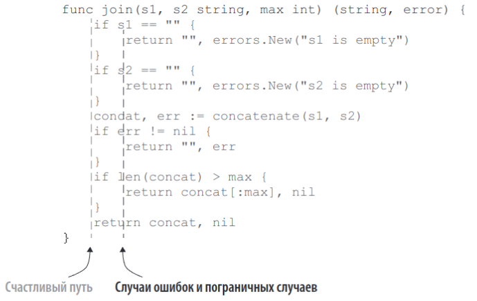
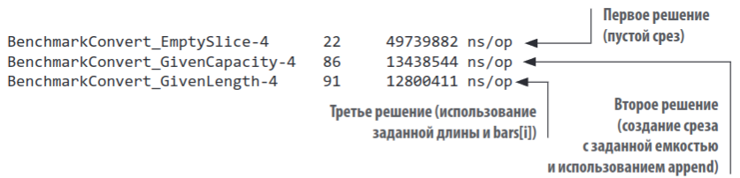
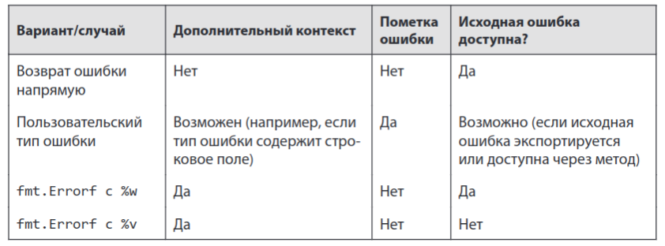
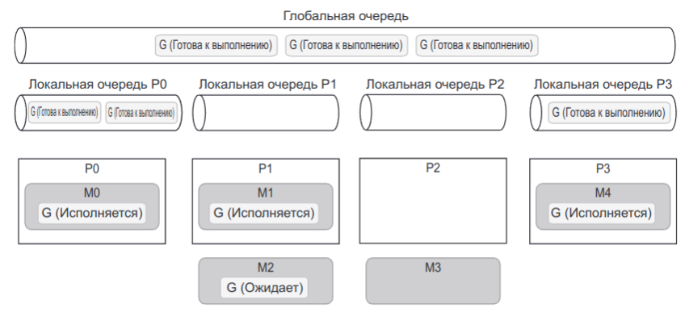
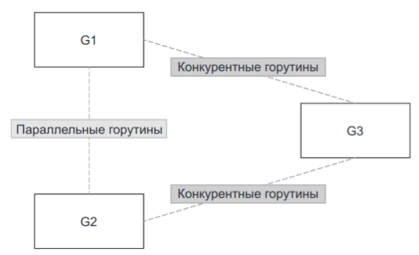
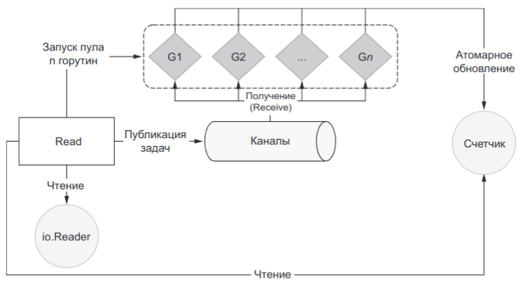
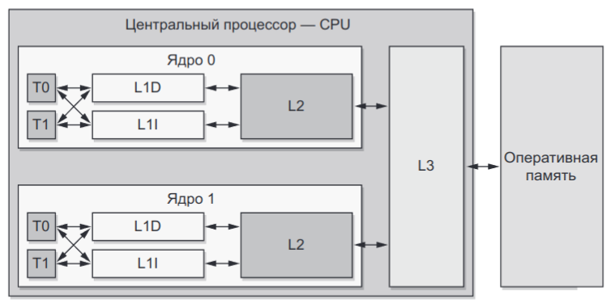
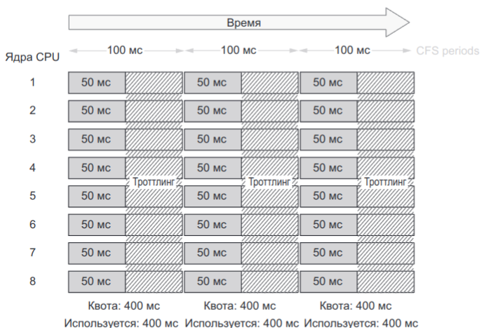

<hr>

- Название: **"100 ошибок Go и как их избежать"**
- Автор: **Тейва Харшани**
- Начало чтения: **13.11.24**
- Конец чтения: **21.12.24**
- Чистое время чтения: **16 часов**

<hr>

## Введение

- **Откуда узнал про книгу:** коллега посоветовал на code-review.
- **Цель на проработку книги:** повысить качество моего Go-кода
- **Глобальная цель:** создавать более качественные информационные системы
- **Задачи:**
	1. Разобрать популярные ошибки
	2. Законспектировать их
	3. Постараться запомнить и не повторять
	4. Обращать внимание на них на селф-ревью и на ревью кода коллег
## Рецензия

Отличная книга про нюансы Go. Автор акцентирует внимание не на синтаксисе и возможностях языка, а на том, как этими возможностями правильно пользоваться. Рекомендую к прочтению после ознакомления с базой по Go.

**Что понравилось:**
- Подробный разбор популярных ошибок и полезные советы
- Хорошая структура книги. От простого к сложному, разбиение ошибок на главы

**Что не понравилось и на что обратить внимание:**
- Местами странный перевод. В русскоязычном Go-комьюнити "slice" — это "слайс", а не "срез", "map" — "мапа", а не "карта", "kafka topic" — "топик", а не "тема"
- Некоторые ошибки явно были добавлены или выделены в отдельный пункт ради красивой цифры "100" в названии книги. В своём конспекте я удалил и перегруппировал некоторые ошибки
- Редко, но встречаются опечатки. `recovery` вместо `recover`; в int64 байты вместо битов
- На декабрь 2024 года часть моментов уже устарела после выхода Go 1.23. Оригинал был опубликован в августе 2022 года
- Странные названия ошибок в формате "Не понимать X", "Не использовать Y". В своём конспекте я заменил их на названия вида "Про X"

## Конспект

**Разница между "просто" и "легко":**
- Просто — несложно для изучения.
- Легко — в процессе обучения не возникает трудностей.

Go простой, но не лёгкий.

### #1 Не затенять переменные

```go
var a int
if true {
	a, err := 1, errors.New
	fmt.Println(a)
} else {
	a, err := 2, errors.New
	fmt.Println(a)
}
// a = 0
```

Неудобно.

Чтобы пофиксить, есть два способа:
1. Назвать внутреннюю переменную по-другому, а потом присвоить во внешнюю переменную значение
2. Заранее определить err

Второй способ лучше:
- Меньше присваиваний
- Можно обрабатывать ошибку после ифов

*Отлично, я получил подтверждение, что заранее определять err - не кринж*

### #2 Убирать лишнюю вложенность

> Выравнивать happy way по левому краю. Так можно быстро понять, что будет в правильном случае



### #3 Про функцию `init`

#### Концепция

`init` — функция для инициализации состояния приложения. Не имеет аргументов и не возвращает результата

```go
package main

import "fmt"

var a = func() int {
	fmt.Println("1")
	return 0
}

func init() {
	fmt.Println("2")
}

func main() {
	fmt.Println("3")
}
```

Если импортим другие пакеты, сначала будут вызваны init-ы из них. Но не стоит полагаться на порядок вызовов этих импортируемых инитов

Можно использовать init для побочных эффектов. Если импортнуть пакет с `import _ "package"`, то выполнится его init.

*Аа, так вот, как работает net/pprof!*

Проблемы:
1. Обработка ошибок — только паника
2. Усложняют тестирование
3. Состояние можно определять только через глобальные переменные

### #5 — #7 Интерфейсы

**Когда использовать**
1. Общее поведение. Несколько типов реализуют одно поведение
2. Снижение связанности. Нужно полагаться на абстракции, а не на реализацию. Это L из SOLID
3. Ограничение поведения

**Важно!** Нужно не конструировать интерфейсы, а ждать, когда они понадобятся.

В Go интерфейсы определяются неявно. В т. ч. поэтому **интерфейсы должны быть на стороне потребителя**.

- Возвращать структуры вместо интерфейсов. Иначе огромная связанность.
- Принимать интерфейсы, если это возможно

Тип `error` — исключение из этого правила. Он ведь интерфейс!

Много методов у структуры — не проблема. Клиенты могут использовать свои интерфейсы поуже.

### #10 Про встраивание типов

```go
type Foo struct {
	Bar
}

type Bar struct {
	Baz int
}

foo := Foo{}
foo.Baz = 42
```

Можно встраивать интерфейсы для их объединения — сейчас не об этом.

Что важно помнить: встраиваемые (продвигаемые) методы становятся доступны наружу. Нужно внимательно смотреть, чтобы не экспортнуть лишнего.

Мьютексы 100% нужно инкапсулировать внутренним полем структуры, а не встраивать.

**Когда нужно встраивание:** чтобы не было такого, что у структуры есть методы, вся суть которых — вызвать методы вложенной структуры.

### #12 — #14 Организованность проекта

Базовый темплейт:

- `/cmd` — основные исходные файлы. Файл main.go приложения foo должен находиться в /cmd/foo/main.go.
- `/internal` — закрытый (private) код: мы не хотим, чтобы другие импортировали его для своих приложений или библиотек.
- `/pkg` — общедоступный (public) код, который мы хотим предоставлять другим в пользование.
- `/test` — дополнительные внешние тесты и тестовые данные. Юнит тесты в Go находятся в том же пакете, что и исходные файлы. Тут тесты API / интеграционные.
- `/configs` — файлы конфигурации.
- `/docs` — проектные и пользовательские документы.
- `/examples` — примеры для нашего приложения и/или общедоступной библиотеки.
- `/api` — файлы контрактов API (Swagger, Protocol Buffers и т. д.).
- `/web` — ресурсы, относящиеся к веб-приложению (статические файлы и т. д.).
- `/build` — файлы упаковки и непрерывной интеграции (CI).
- `/scripts` — скрипты для анализа, установки и т. д.
- `/vendor` — зависимости приложений (например, зависимости модулей Go).

**Совет:** не создавать кучу пакетов преждевременно. Не усложнять структуру.

Полезно **называть пакеты, отталкиваясь от их возможностей**, а не от содержимого. В идеале — название из одного слова в нижнем регистре.

`utils`, `common`, `base` — плохие пакеты

Плохо, когда пакеты и переменные имеют одинаковые имена. Нужно либо именовать переменные по-другому, либо создавать алиасы для импортов.

### #15 Писать документацию по коду

Экспортируемый объект должен быть задокументирован

```go
// Customer - это представление потребителя.
type Customer struct{}
```

Каждый комментарий — предложение, заканчивающееся точкой.

Описание функции — **что**, а не **как** она делает.

```go
// SomeFunc возвращает че-то.
// Deprecated: Не использовать.
func SomeFunc() {}
```

Когда документируем константу или переменную, нужно отметить два момента: назначение и содержание.

```go
// DefaultPermission разрешение по умолчанию, используемое движком магазина.
const DefaultPermission = 0o644 // Необходим доступ на чтение и запись.
```

Дока на пакет:

```go
// Пакет math предоставляет основные константы и математические функции.
//
// Этот пакет не гарантирует битовую идентичность результатов // в разных архитектурах.
package math
```

### #17 Про восьмиричные литералы

```go
a := 010 // Это 10 в восьмиричной, т е 8 в десятичной
```

Для понятности лучше добавлять в начало `0o` вместо `0`.

Пример применения для прав доступа:

```go
file, err := os.OpenFile("foo", os.O_RDONLY, 0o644)
```

Другие префиксы:
- `0b` — двоичная
- `0x` — шестнадцатеричная
- суффикс `i` — мнимые
- Можно использовать `_` для разделения разрядов, как в Python

### #18 Целочисленные переполнения

Помнить про то, что они есть.

Чтобы обнаруживать, делаем проверки:
- Перед инкрементом 
```go
func Inc32(counter int32) int32 {
	if counter == math.MaxInt32 { // Сравнение с math.MaxInt32 
		panic("int32 overflow")
	}
	return counter + 1
}
```
- Перед сложением
- Перед умножением

### #19 Проблемы с плавающей запятой

`float32`:
- 8 бит — на экспоненту
- 23 бит — на мантиссу
- 1 бит — знак

`float64`:
- 11 бит — на экспоненту
- 52 бит — на мантиссу
- 1 бит — знак

```
число = знак * 2^экспонента * мантисса
```

- Не использовать `==` для float. Сравнивать с заданной точностью
- При выполнении цепочки сложений/вычитаний сгруппировать операции для чисел с одинаковым порядком величин, перед тем, как делать операции с другими порядками
- Для повышения точности сначала делаем умножение/деление, а потом сложение/вычитание. Раскрываем скобки

### #20 — #26 Про слайсы

Ёмкость удваивается, пока не достигнет 1024. После увеличивается на 25%

Добавление эллемента в полный слайс (длина == ёмкость) приводит к созданию нового массива с новой ёмкостью и копированию всех элементов в новый массив.

Нужно инициализировать слайс сразу с заданными ёмкостью и/или размером, если возможно.


Иногда лучше задавать только ёмкость, но не размер, если это повышает читаемость кода.

**Пустой vs нулевой слайсы**

| Пустой слайс      | Нулевой слайс        |
| ----------------- | -------------------- |
| `len(s) == 0`     | `s == nil`           |
| Выделяется память | Не выделяется память |
| Append работает   | Append работает      |

Нулевой срез всегда пустой, но не наоборот.

| `var s []string`     | `s = []string{}`              | `s = make([]string, 0)` |
| -------------------- | ----------------------------- | ----------------------- |
| `nil`                | `len = 0, not nil`            | `len = 0, not nil`      |
| `"s: null" в JSON`   | `"s: []" в JSON`              | `"s: []" в JSON`        |
| Когда срез мб пустым | Когда есть начальные элементы | Когда длина известна    |

Проверяем слайс на пустоту через `if len(s) == 0`. Работает и с пустыми и с нулевыми. Аналогично с мапами.

**Создание копий слайсов**

```go
src := []int{0, 1, 2}
var dst []int
copy(dst, src)
fmt.Prinln(dst) // [], а не [1, 2, 3]
```

**Важно!** `copy` копирует `N` элементов, где `N = min(len(dst), len(src))`. Если len(dst)=0, то ничего не будет копироваться. Нужно инициализировать слайс, в который копируем:

```go
dst := make([]int, len(src))
```

**Побочные эффекты append**

```go
s1 := []int{1, 2, 3}
s2 := s1[1:2]
s3 := append(s2, 10)
// Итог: s1=[1, 2, 10], s2 = [2], s3 = [2, 10]
```

Аккуратно нужно быть с этим.

**Слайсы и утечки памяти**

```go
func consumeMessages() {
	for {
		msg := receiveMessage()
		// Производится какая-то операция с msg 
		storeMessageType(getMessageType(msg))
	}
}

func getMessageType(msg []byte) []byte {
	return msg[:5] // Вот тут capacity нового слайса будет то же, что у msg. Это приводит к лишним аллокациям
}
```

Решение:

```go
func getMessageType(msg []byte) []byte {
	msgType := make([]byte, 5)
	copy(msgType, msg)
	return msgType
}
```

**Итог:** если делать срезы больших слайсов, это может приводить к тому, что останется лишняя аллоцированная память. Поэтому лучше использовать копии слайсов.

Аналогично, если слайс хранит структуры. Аллоцированная память сама не очистится. Делаем через copy!

### #27, #28 Про map

Количество сегментов в мапе увеличивается в размере в 2 раза, если:
- Среднее кол-во эл-тов в сегментах > 6.5
- Слишком много сегментов переполнены (> 8 эл-тов)

Аналогично, как и со срезами, лучше заранее задать размер мапы, чтобы избежать лишних аллокаций и перемещений элементов.

Бенчмарк для 1 млн. эл-тов: с заданием размера на 60% быстрее!

**Мапы и утечки памяти**

Количество сегментов в мапе не может уменьшаться. Удаление элементов из мапы лишь затирает слоты в сегментах.

Если ключ или значение превышают 128 байт, Go не хранит их в сегментах мапы. Там автоматически будут храниться указатели.

Как сравнивать срезы и мапы? Через `reflect`.

`reflect.DeepEqual` — рекурсивный обход и сравнение. Важно помнить:
- Она различает пустые и нулевые коллекции
- В ~100 раз медленнее, чем `==`. Так что лучше использовать в тестах, а не в рантайме

Если производительность важна, лучше писать собственные функции сравнения. В ещё проверить, какие есть функции в стандартной библиотеке.

### #30 — #35 Про range

В Go всё, что мы присваиваем, является копией.
- Если мы присваиваем в переменную результат ф-ции, кот. возвращает структуру, Go создаёт копию этой структуры
- Если мы присваиваем в переменную результат ф-ции, кот. возвращает указатель, Go создаёт копию этого указателя

Когда range совершает итерацию по структуре, он **копирует** каждое значение в переменную-значение.

```go
for _, customer := range custorems { // []Customer
	fmt.Println(&customer) // Здесь будет один и тот же адрес временной переменной customer
}
```

Решения:
1. Создаём локальную переменную внутри цикла и присваиваем в неё значение переменной customer
2. Внутри цикла: `cusomer := &customers[i]`

**Вычисление аргументов в range**

При использовании range указываемое выражение вычисляется перед началом цикла.

```go
s := []int{1, 2, 3}
for range s {
	s = append(s, 10)
}
fmt.Println(s) // 1, 2, 3, 10, 10, 10
```

Тут всё ок.

А вот это:
```go
s := []int{1, 2, 3}
for i := 0; i < len(s); i++ {
	s = append(s, 10)
}
fmt.Println(s) // 1, 2, 3, 10, 10, 10, 10, 10, ...
```
не закончится никогда.

Если хотим смотреть на реальные значения, а не на копии, нужно использовать указатели.

Не стоит использовать defer внутри функции. Он будет вызван не на каждой итерации, а после выхода из всей функции. Решение: создать вокруг defer другую функцию, которую уже вызывать в цикле.

### #36 Концепция рун

В Go строка — это неизменяемая структура, которая хранит в себе:
- Указатель на неизменяемую последовательность байтов
- Общее количество байтов в последовательности

Кодировка символов (charset) — это набор символов. Unicode — это 2^21 символов.

Кодирование (encoding) — перевод списка символов в двоичный код. UTF-8 — стандарт кодирования, определяющий, как можно закодировать unicode-символы в 1-4 байтах

- В Go руна — кодовая точка Unicode
- UTF-8 — 1-4 байта, т е 32 бита максимум
- `type rune = int32`
- В Go строки не всегда закодированы в UTF-8

`len(s)` — возвращает кол-во **байтов**, а не символов.

### #37 Итерация по строкам

```go
fmt.Prinln(utf8.RuneCountInString(s)) // Кол-во рун в строке
// Зависит от кодировки!
```

Неверная итерация:
```go
for i := range s {
	fmt.Prinln("%d: %c\n", i, s[i])
}
```
тут мы итерируемся по каждому начальному индексу руны, а не по самой руне.

Верный вариант №1:

```go
for i, r := range s {
	fmt.Prinln("%d: %c\n", i, r)
}
```

- Нет выделения доп памяти
- Нельзя обратиться к руне по индексу

Верный вариант №2:

```go
runes := []rune(s)
for i, r := range runes {
	fmt.Prinln("%d: %c\n", i, r)
}
```

- Есть выделение доп. памяти
- Можно обратиться к руне по индексу

### #39 Оптимизации при сложении строк

Решение "в лоб":

```go
func concat(values []string) string {
	s := ""
	for _, value := range values {
		s += value
	}
	return s
}
```

Проблема: строки неизменяемые, поэтому на каждой итерации выделяется новая память для s.

Решение: `strings.Builder`:

```go
func concat(values []string) string {
	sb := strings.Builder{}
	for _, value := range values {
		_, _ := sb.WriteString(value)
	}
	return sb.String()
}
```

Под капотом слайс байт. `WriteString` -> `append`. Следствия:
- Нельзя использовать в режиме конкурентного выполнения
- Если будущая длина известна, можно заранее место выделить: `sb.Grow(n)` - выделение места (в байтах)

`strings.Builder` лучше использовать в циклах. Если просто складываем две строки, то `+=` или `fmt.Sprintf` будет лучше, т к нагляднее.

Эмпирическое правило: `strings.Builder` начиная от 5 строк.

### #40 Избегаем лишние преобразования строк

Не нужно преобразовывать туда-сюда `strings` <-> `[]byte`. Каждое преобразование — выделение доп. памяти.

Пакет `bytes` содержит много функций, которые есть и в strings. Например, `TrimSpace`.

Все операции ввода/вывода происходят с `[]byte`, а не со строками.

### #41 Подстроки и утечки памяти

Подстроки:
```go
s1 := "Hello, World!"
s2 := s1[:5] // По байтам!
s3 := string([]rune(s1)[:5]) // По рунам!
```

При выделении подстрок используется та же память, что и на исходную строку. Если исходная строка большая, а мы берем её малую часть, то в памяти остаётся место под большую строку.

Решение:

```go
uuid := strings.Clone(str[:36])
```

### #42 Типы получателей

Метод — функция, привязанная к конкретному типу. Этот тип — **получатель** (указатель или значение).

При использовании получателя-значения Go копирует значение и передаёт его методу. Меняется только копия объекта.

При использовании получателя-указателю методу передаётся указатель. Тут копируется только указатель, но не сам объект. Меняется сам объект.

Получатель **должен** быть **указателем**:
- Если меняем получатель
- Если в получателе есть поле, которое нельзя скопировать (sync)

Получатель **следует** делать **указателем**:
- Если он крупный

Получатель **должен** быть **значением**:
- Нужно обеспечить неизменяемость
- Получатель — map, функция или канал. Иначе — ошибка компиляции

Получатель **следует** делать **значением**:
- Получатель — слайс, который не нужно менять
- Небольшой массив/структура без изменяющихся полей
- Получатель — базовый тип

Следует избегать смешения типов получателей!

### #43, #44 Именованные параметры результата

Используем в интерфейсе для понятности:
```go
type locator interface {
	getCoordinates(address string) (lat, lng float32, err error)
}
```

Не используем в таких случаях:
```go
func StoreCustomer (customer Customer) (err error)
```
Тут ничего понятнее не становится.

Пустые `return` допустимы в коротких функциях. Иначе они вредят удобочитаемости. Либо только пустые, либо только с аргументами в рамках одной функции!

Можно забыть присвоить значение переменной `err error` и тогда будем возвращать пустую ошибку. Трудно заметить.

### #45 Возврат получателя nil

**Важно!** Получатель-указатель может быть `nil`.

```go
type Foo struct{}

func (f *Foo) Bar() string {
	return "bar"
}

func main() {
	var f *Foo
	fmt.Println(foo.Bar()) // "bar" выведет!
}
```

В Go метод — это синтаксический сахар для функции. Т. е. эта функция по сути:
```go
func Bar(f *Foo) string {
	return "bar"
}
```

В такой ситуации:

```go
func (c Customer) Validate() error {
	var m *MultiError
	if m != nil {
		return m
	}
	return nil
}
```

Нужно явно проверять `m` на `nil`. Иначе `*MultiError`, завернутый в `error` уже будет не nil.

**Правило:** Когда нужно вернуть интерфейс (в т. ч. error), нужно возвращать не нулевой указатель, а явно nil.

### #46 Не использовать имя файла в качестве входных данных функции

Может вызвать сложности с написанием unit-тестов. Потребуется отдельный файл на каждый тест-кейс. *— Это то, о чем мне говорили один раз на собесе*

Лучше:
```go
func countEmptyLines(reader io.Reader) (int, error) {
	scanner := bufio.NewScanner(reader)
}
```

### #47 Вычисление аргументов и получателей в defer

Аргументы функции в defer вычисляются сразу при объявлении.

Решение:
1. Использовать указатели. Нужно менять сигнатуру вызываемых функций, не всегда возможно
2. Использовать замыкация

Аналогично с получателями. Если вызываем метод получателя в defer, а получатель — значение, то он вычисляется сразу. Если указатель, то потом.

### #48 Паника

Применение `recover`:

```go
func main() {
	defer func() {
		if r := recover(); r != nil {
			fmt.Println("recover", r)
		}
	}()
	fmt.Prinln("a") // a
	panic("foo") // recover foo
}
```

`panic` для по-настоящему исключительных ситуаций, когда ошибся скорее программист.

Функции, начинающиеся с `Must` возвращают только сам объект и паникуют в случае ошибки. *— Полезное правило, узнал об этом на собесе.*

### #49 — #51 Типы и значения ошибок

`%w` - для оборачивания ошибок. **Оборачивание** — упаковка в обертку так, что исходная ошибка тоже доступна.

Зачем нужно:
1. Больше контекста
2. Маркировка ошибки как специфической

```go
if err != nil {
	return fmt.Errorf("bar failed: %w", err)
}
```

И альтернатива - `%v`:
```go
if err != nil {
	return fmt.Errorf("bar failed: %v", err)
}
```
В этом случае будет создана новая ошибка. Исходная не будет доступна.



**Проверка типов ошибок**

```go
if errors.As(err, &transientError{}) {
	// ...
}
```

Рекурсивно разворачивает ошибку и проверяет, есть ли в её слоях ошибка `transientError`.

**Проверка значения ошибок**

Сигнальная ошибка — ошибка как глобальная переменная
```go
import "errors"

var ErrFoo = errors.New("foo")
```

Правильная проверка значения ошибок
```go
if errors.Is(err, sql.ErrNoRows) {
	// ...
}
```

`errors.Is` вместо `==` позволяет сравнить значения ошибок, даже если ошибка обернута через `%w`.

### #52, #53 Обработка ошибок

Плохо, когда одна и та же ошибка записывается в лог несколько раз из разных мест. Усложняет отладку: при конкурентном выполнении строки будут перемешаны.

Нужно либо регистрировать, либо возвращать ошибку, но не одновременно.

Общий рецепт:
1. Из "конечных" функций с БЛ возвращаем ошибку с контекстом
2. В ф-циях посредниках оборачиваем эту ошибку большим контекстом 
3. На верхнем уровне пишем лог.

Если мы хотим игнорировать ошибку, нужно явно прописать:

```go
_ = notify()

func notify() error {
	// ...
}
```

Лучше добавить комментарий с объяснением, **почему** игнорируем ошибку.

### #54 Обработка ошибок defer

Вместо:

```go
defer rows.Close()
```

Лучше:

```go
defer func() {
	err := rows.Close()
	if err != nil {
		// log err
	}
}()
```

Если хотим вернуть ошибку вызывающей функции, нужно использовать именованные параметры результата. Но быть внимательным! Если сама ф-ция тоже возвращает ошибку, то defer может её затереть.

```go
defer func() {
	closeErr := rows.Close()
	if err != nil {
		if closeErr != nil { // Определяем, что важнее
			// log
		}
		return
	}
	err = closeErr
}()
```

### #55, #56 Конкурентность и параллелизм

2 бариста + 2 кофемашины вместо одного и одной в кофейне — **параллелизм**.

Два бариста, но с разделением ролей (касса + выдача), одна кофемашина + 2 очереди на заказ и на выдачу — это **конкурентность**.

Конкурентность обеспечивает возможность параллелизма.

**Конкурентность не всегда быстрее!**

Поток — наименьшая единица обработки, кот. выполняет ОС. Потоки одного процесса мб:
- конкуретными. 2+ потоков выполняются и завершаются в перекрывающиеся периоды времени
- параллельными. Одна задача несколько раз выполняется одноврменно.

Ядро процессора выполняет потоки. Переключение потоков — переключение контекста (дорогая операция).

Горутины —- это потоки на уровне Go. Горутика — **2Кб**, поток ОС — **2Мб**.

Переключение горутин на 80-90% быстрее переключения потоков ОС.



Go может создавать больше `M`, чем `GOMAXPROC` при необходимости.

На каждый 61-й такт выполнения Go-планировщик проверяет глобальную очередь. Если там пусто, ворует горутины (work stealing) у других `P` для простаивающего.

**Пример:** распараллеливание сортировки слиянием.

Вывод: распараллеливание эффективно только при наличии порога кол-ва элементов, начиная с которого будем параллелить. Иначе получается слишком много аллокаций и эффективность теряется.

```
Benchmark_sequentialMergesort-4 2278993555 ns/op
Benchmark_parallelMergesortV1-4 17525998709 ns/op
Benchmark_parallelMergesortV2-4 1313010260 ns/op
```

Правильно распараллеленный алгоритм эффективнее последовательного. Но нужно играться со значениями и проводить бенчмарки. Если распараллелить "в лоб", будет хуже, чем при линейном.

### #57 Каналы и мьютексы



В общем случае:
- Синхронизация между **параллельными** горутинами должна достигаться с помощью **мьютексов**
- Координация между **конкуретными** горутинами — с помощью **каналов**

Мьютексы — про разделение состояния или доступ к ресурсам. Канал — механизм для передачи сигналов (с данными или без).

### #58 Проблемы гонки

**Гонка данных (data race)** — 2+ горутин обращаются к одному и тому же участку памяти, причем как минимум одна — на запись. Именно на запись, т к она включает в себя последовательность действий "Прочитать -> обработать -> записать" и проблемы возникают, когда этапы из нескольких горутин перемешиваются.

Решения:
1. Атомики (`atomic.AddInit64` для счетчиков)
2. Мьютексы

Атомики могут работать только с определёнными типами данных. Если нужны другие — используем мьютексы.

3. Синхронизация через каналы.

**Состояние гонки (race condition)** — поведение зависит от последовательности действий, которые невозможно контролировать (порядок выполнения горутин, например)

**Гонка данных != состояние гонки.**

### #59 Влияние типа нагрузки на конкурентность

**Паттерн Worker Pool:**




Размер пулла зависит от типа рабочей нагрузки.

- **I/O-bound**: с каким кол-вом конкуретных обращений справится система, если хотим максимизировать пропускную способность
-  **СPU-bound**: полагаемся на GOMAXPROCS

```go
n := runtime.GOMAXPROCS(0) // Получаем текущее значение, не изменяя его
```

Запускаем столько воркеров в пулле, сколько указано в GOMAXPROCS. Это позволит достичь оптимальной картины, в которой на каждом P исполняется горутина воркер-пулла и время на overhead на переключение контекста минимален.

Проверяем предположения при помощи бенчмарков!

### #60, #61 Контексты Go

> Контекст переносит deadline, сигналы отмены и другие значения через границы API.

#### Дедлайн

Контекстно зависимая (context aware) функция — та, что может отменить запрос после отмены контекста.

```go
func publishPosition(position int) error {
	ctx, cancel := context.WithTimeout(context.Background(), 4*time.Second) // Через 4 секунды данные станут неактуальны
	defer cancel()
	return h.pub.Publish(ctx, position)
}
```

`defer cancel()` нужно, чтобы прервать контекст при выходе из родительской функции, если это произойдёт раньше, чем через 4 сек.

#### Сигнал отмены

```go
func main() {
	ctx, cancel := context.WithCancel(context.Background())
	defer cancel()
	go func() {
		someFunc(ctx, 123)
	}()
}
```

Когда произойдет выход из main мы хотим сообщить об этом дочерней функции, чтобы она корректно завершила работу. Делаем мы это посредством сигнала отмены, который передается через контекст.

#### Значения в контекстах

```go
ctx := context.WithValue(parentCtx, "key", "value")
fmt.Println(ctx.Value("key"))
```

Тип ключа — `any`. Если бы были только строки, это могло бы привести к коллизиям между значениями, устанавливаемыми в разных пакетах на один и тот же контекст.

Best practice: создавать в пакетах свой неэкспортируемый тип ключей для значений в контекстах:

```go
package provider

type key string

const myCustomKey key = "key"

func f(ctx context.Context) {
	ctx = context.WithValue(key, "value")
}
```

Пример использования: в middleware HTTP. Что-то проверяем в middleware; пишем в контекст; в обработчике читаем значение из контекста.

#### Перехват отмены контекста

Метод `Done` возвращает канал `<-chan struct{}`, который закрывается по дедлайну или при вызове `cancel()`. Все потребители должны узнать о том, что канал закрылся. Поэтому сигнал отмены контекста реализован через механизм закрытия канала, а не передачу какого-либо значения.

Метод `Err` возвращает `nil`, если канал ещё не закрыт. Если закрыт, возвращает ошибку, которая объясняет, по какой именно причине канал был закрыт (дедлайн или cancel).

В функции, получающей контекст, обязательно использовать `select`, таким образом, чтобы операция чтения из `ctx.Done()` не была заблокирована.

```go
func f(ctx context.Context) error {
	select {
		case <- ctx.Done():
			return ctx.Err()
		case ch1 <- 124: 
	}
}
```

Другой типичный кейс: бесконечный `for`, в котором мы читаем сообщения из канала или ждём завершения контекста.

Прежде чем прокидывать контекст, нужно думать, когда он будет отменён.

Если стоит задача передать родительский контекст (чтобы сохранить значения, например), но без отмены, стандартного решения под это нет. Нужно писать свой контекст.

### #62 Запуск горутин

При запуске горутины важно понимать, когда она будет остановлена.

Горутина — такой же ресурс, как  и остальные, и он должен быть корректно закрыт.

Утечки горутин -> утечки всех ресурсов, с которыми она работает. Память, http-соединения, соединения с БД и тд.

Пример утечки:

```go
ch := foo()
go func() {
	for i := range ch {
		// ...
	}
}()
// ...
```

Если канал ch не будет закрыт, произойдёт утечка горутин.

Пример: создаём горутину, которая будет в фоне что-то делать. Хотим, чтобы в момент остановки программы она корректно завершалась. Если передать контекст, у нас не будет гарантии, что ресурсы успеют освободиться: мы не блокали нашу основную горутину. Правильнее сделать через метод `close()`:

```go
func main() {
	w := newWatcher()
	defer w.close()
}

func newWatcher() watcher {
	w := watcher{}
	go w.watch()
	return w
}

func (w watcher) close() {
	// Освобождение ресурсов
}
```
### #63 Горутины и переменные цикла

```go
s := []int{1, 2, 3}
for _, i := range {
	go func() {
		fmt.Print(i)
	}()
}
```

Горутина не фиксирует состояние переменных; этот код не детерменирован (233, 333 и тд).

Решается:
1. Созданием локальной переменной внутри цикла
2. Добавлением i в качестве параметра в создаваемую функцию

*Кажется, в какой-то из последних версий Go эту особенность пофиксили.*
### #64 Про использование select и каналов

Если одни или несколько `case` в `select` мб выполнены, то будет выбрана только одна из них при помощи равномерного псевдослучайного выбора. Нет гарантии порядка, в отличие от switch.

### #65 Каналы уведомлений

Правильный способ создания канала для уведомлений (важен факт сообщения, а не данные) — `chan struct{}`.
- `struct{}` занимает ровно 0 байт
- `interface{}` занимает 8/16 байт в 32/64 битных системах

### #66 Нулевые каналы

```go
var ch1 chan int // Нулевой канал
<-ch1 // Паники не будет. Блокируемся навсегда

var ch2 chan int // Нулевой канал
ch2 <- 1 // Паники не будет. Блокируемся навсегда
```

Чтение из закрытого канала — неблокирующая операция.

Правильная реализация слияния каналов:

```go
func merge(ch1, ch2 <-chan int) <- chan int {
	ch := make(chan int, 1)
	go func() {
		for ch1 != nil || ch2 != nil {
			select {
			case v, open := <-ch1:
				if !open {
					ch1 = nil
					break
				}
				ch <- v
			case v, open := <-ch2:
				if !open {
					ch2 = nil
					break
				}
				ch <- v
			}
		}
		close(ch)
	}()
	return ch
}
```

Эта функция будет корректно обрабатывать сценарий, когда один из каналов закрыт, а второй ещё нет. Т к чтение из nil канала - блокирующее, в select мы никогда не будем заходить в ветку с закрытым каналом.

### #67 Размер канала

Нужно четко понимать ответ на 2 вопроса:
1. Какой канал нужен: буферизованный или небуферизованный?
2. Если буфферизованный, то какого размера.

**Небуферизованный канал**:
- Отправитель блокируется до тех пор, пока получатель не получит данные из канала
- Обеспечивает синхрониацию. Одна - отправляет, другая - получает
- Можно использовать в качестве каналов уведомлений, где уведомлением является закрытие канала

**Буферизованный**:
- Отправитель посылает данные в канал, пока канал не заполнится
- Когда заполнится - блокируемся, пока получатель не прочтёт сообщения
- Не обеспечивает сильной синхронизации. Отправитель может отправить и продолжить выполнение

Чтобы определить размер буферизованного канала, задаём вопрос: "Есть ли причина использовать не 1?"

Когда есть:
- Паттерн worker pool
- Для ограничения скорости выполнения (rate limiter на отправку)

Значение нужно задавать исходя из веских оснований. Не оставлять в коде строки с созданием каналов с магическими числами.

Как правило, очереди всегда или близки к заполнению, или почти пусты. Найти баланс сложно. Поэтому редко имеет смысл подбирать какие-то хитрые значения размеров каналов. Если хочется, то нужно проводить бенчмарки

### #68 Про форматирование строк

`fmt.Sprintf("%v", ctx)` может привести к гонке, если в момент чтения кто-то будет менять переменные в контексте.

Подчеркивается важность юнит-тестирования всех сценариев.

Важно минимизировать область блокировки мьютекса.

### #70 Про использование мьютекстов с слайсами и мапами

Важно помнить: слайс и мапа — указатели на структуры. При копировании указателей не происходит полного копирования данных, лежащих за ними.

Нужно сделать, чтобы мьютексом были защищены не только указатели, но и сами данные.

### #71 Про sync.WaitGroup

Если счетчик `sync.WaitGroup` станет отрицательным, будет паника.

- Вызывать `wg.Add` перед запуском горутины, а не в самой горутине
- Можно вызывать `wg.Add(n)` перед циклом запуска горутин, если n известно. Это хорошее решение.

### #72 Про sync.Cond

Пример: хотим отслеживать достижение разных сумм на балансе. Одна горутина добавляет деньги, другие — слушают и реагируют на превышение границы 10 и 15 денег.

Решения:
1. Мьютексы + бесконечные циклы в ждущих горутинах. Работает, но тратит кучу CPU на циклы.
2. Каналы. Проблемы:
	1. Если обе горутины будут слушать один канал, то сообщение прочитает только одна из них. 
	2. Отправитель не знает, когда все получатели прекратят слушать => канал в какой-то момент забьётся.
3. sync.Cond

Cond использует мьютексы для предотвращения гонки данных.

```go
type Donation struct {
	cond *sync.Cond
	balance int
}

donation := &Donation{
	cond: sync.NewCond(&sync.Mutex{})
}

// горутины-слушатели
f := func(goal int) {
	donation.cond.L.Lock()
	for donation.balance < goal {
		donation.cond.Wait() // Ждём, когда придёт сообщение об обновлении балланса
	}
	fmt.Printf("%d$ goal reached\n", donation.balance) 
	donation.cond.L.Unlock()
}
go f(10)
go f(15)

// горутина обновления
for {
	time.Sleep(time.Second)
	donation.cond.L.Lock()
	donation.balance++ 
	donation.cond.L.Unlock()
	donation.cond.Broadcast() // Отправляем сообщение, что балланс обновлен
}
```

Если в момент вызова Broadcast нет горутин, ожидающих события, оно будет пропущено.

`Signal` вместо `Broadcast` пробуждает только одну горутину.

### #73 Errgroup

`golang.org/x` — расширения стандартной библиотеки. Там в т.ч. лежит `sync`.

```go
g, ctx := errgroup.Withcontext(ctx)

g.Go() // Запуск

if err := g.Wait(); err != nil {
	return nil, err
}
return results, nil
```

Запускаем параллельно несколько горутин, если одна вернула ошибку, не ждём других.

Важно: процесс, вызывыемый в `g.Go()` должен быть контекстно-зависимый, иначе отмена контекста в первой "сломавшейся" горутине не будет иметь смысла.

### #74 Про копирование sync

Примитивы синхронизации из пакета sync (мьютексты и тд) копировать никогда нельзя!

Важно, что делаем это не "по привычке", а именно из-за того, что при копировании никакой синхронизации не будет (будем работать с копиями).

`go vet` отлавливает это проблему

### #75 Время

`time.Duration` — время в **наносекундах**. Важно всегда использовать time.Duration API: `time.Microsecond` и т. д.

### #77 Ошибки при обработке JSON

**1. Неожиданное поведение из-за встраивания типов**

Встроенные типы могут затирать всю структуру, т к будут использоваться их методы для маршализации (`MarshalJSON`).

Можно пофиксить, если структура, содержащая встроенные типы, будет реализовывать интерфейс:

```go
type Marshaler interface {
	MarshalJSON() ([]byte, error)
}
```

именно за счет своего метода, а не за счет "продвижения" этого метода встроенного типа.

**2. Монотонные часы**

ОС поддерживает два типа часов: настенные (wall clock) и монотонные (monotonic clock).

Настенные — для определения текущего времени суток. Могут быть изменены, например, при синхронизации через NTP.

Монотонные — для определения промежутков времени. У них никогда не будет скачков, мб только корректировки частоты.

`time.Time` включает в себя оба типа часов.

- `time.Now()` возвращает оба типа часов
- В json кладутся только значения настенных часов

Если результат time.Now маршализовать в JSON, а потом сразу демаршализовать, то результаты не будут равны.

`==` сравнивает все поля `time.Time`, в т ч значения монотонных часов. Чтобы этого избежать, можно использовать метод `Equal`.

`Trunate(0)` — обрезаем монотонную часть.

**3. Мапа со значениями типа any**

```go
b := getMessage()
var m map[string]any
err := json.Unmarshal(b, &m)
```

В таком случае все числовые поля из JSON будут типа `float64`, даже если в JSON они целые.

### #78 Ошибки, связанные с SQL

database/sql предоставляет общий интерфейс для работы с SQL СУБД

**1. sql.Open не всегда устанавливает соединение с БД**

Зависит от драйвера sql. Иногда мб ленивое соединение.

Для того, чтобы убедиться, что соединение открыто, используется `db.Ping` после `sql.Open()`

**2. Пул соединений**

`sql.Open()` возвращает `*sql.DB` — это уже пул соединений. 

Каждое соединение в пуле либо используется, либо простаивает.

Что можно сконфигурировать, вызывая методы `*sql.DB`:
- `SetMaxOpenConns` — максимальное количество открытых подключений (по умолчанию не ограничено). Важно задавать в проде, чтобы не сломать базу
- `SetMaxIdleConns` — максимальное количество неактивных соединений (по умолчанию — 2). Если приложение генерит много одновременных запросов, полезно задать побольше, чтобы не тратить время на создание подключений.
-  `SetConnMaxIdleTime` — максимальное количество времени, которое соединение может простаивать, пока не будет закрыто (по умолчанию не ограничено). Важно задавать, если приложение может столкнуться с всплеском запросов
-  `SetConnMaxLifeTime` — максимальное количество времени, которое соединение мб открыто (по умолчанию не ограничено). Если БД балансирует нагрузку, этим параметром ограничиваем слишком долгие коннекты.

**3. Подготовленные операторы**

```go
stmt, err := db.Prepare("SELECT * FROM ORDER WHERE ID = ?")
if err != nil {
	return nil
}
rows, err := stmt.Qquery(id) // Выполнение
```

Потом закрываем через `stmt.Close()`.

Есть такие же функции, но с контекстом.

**4. Обработка нулевых значений**

Если строки могут содержать `NULL`, то:
1. Их нужно сканировать в переменные типа указателей на целевой тип (`*string`)
2. Либо использовать типы вроде `sql.NullString`. У них 2 метода: `String` - само значение, `Valid` - ответ на вопрос "Является ли не NULL?".

Второй подход чуть нагляднее, но можно использовать оба.

**5. Обработка ошибок итерации строк**

Какие ошибки нужно проверять:
- Ошибки во время выполнения запроса
- Ошибки при закрытии строк
- Ошибки во время сканирования строк
- Ошибки после цикла `rows.Next()` методом `rows.Err()`

### #79 Закрытие временных ресурсов

Все ресурсы, реализующие метод `io.Closer`, в какой-то момент должны быть закрыты.

**1. Тело HTTP**

При получении тела ответа через `http.Get` важно после преобразования тела к строке делать:

```go
defer func() {
	err := resp.Body.Close()
	if err != nil {
		// ...
	}
}
```

Иначе могут быть утечки памяти.

Тело HTTP должно быть закрыто даже если мы его не читаем.

Если хотим, чтобы после обработки запроса HTTP-транспорт не закрывал соединение и оно использовалось для следующего вызова, нужно читать тело запроса, даже если оно нас не интересует:

```go
_, _ := io.Copy(io.Discard, resp.Body)
```

**2. sql.Rows**

Если не закрывать эту структуру, произойдет утечка соединений: соединение не вернётся в пул.

**3. os.File**

Если не закрыть, утечки не будет, т к закроется сборщиком мусора. Но лучше закрывать явно, т к мы не знаем, когда будет вызван сборщик

Закрытие `f.Close()` не гарантирует, что файл будет записан на диск. Он мб в буфере ОС. Чтобы явно записать, нужно вызвать `f.Sync()`.

### #82 Про категории тестов

**1. Теги сборки**

```go
//go:build integration

package db
```

`go test -v .` по умолчанию запускает только тесты без параметров.

`go test --tags=integration -v .` - запускаем **в том числе интеграционные** тесты

Если хотим иметь возможность запускать **только интеграционные** тесты, то остальные нужно пометить флагом:

```go
//go:build !integration

package db
```

Это значит "Запускать только если flag integration не включен"

**2. Переменные среды**

```go
func TestInsert(t *testing.T) {
	if os.Getenv("INTEGRATION") != "true" {
		t.Skip("skipping integration test")
	}
}
```

Преимущество в том, что мы не забудем про эти тесты. Они будут выведены в списке `go test` в любом случае, в отличие от п.1

**3. Короткий режим**

```go
func TestInsert(t *testing.T) {
	if testing.Short() {
		t.Skip("skipping long-running test")
	}
}
```

Скипаем долгие тесты, если включен короткий режим.

`go test -short -v` — запускаем только короткие тесты

Подходы можно комбинировать. Главное — классифицировать тесты

### #83 Флаг `-race`

Отлавливание состояния гонки происходит во время выполнения, а не на этапе компиляции:

Можно добавлять к build или test:

```go
go test -r ./...
```

Компилятор инструментирует (добавляет доп. инструкции) код для обнаружения состояния гонки.

- Потребление памяти может увеличиться 5-10 раз
- Время выполнения может увеличиться в 2-20 раз

Детектор гонки нужно включать только при локальном тестировании или в CI. Не на проде!

Под капотом детектор использует структуру векторные часы.

Не даёт ложноположительных результатов. Может давать ложноотрицательные результаты.

### #84 Режимы выполнения тестов

**1. Флаг parallel**

```go
func TestFoo(t *testing.T) {
	t.Parallel()
}
```

Сначала 1-за-1 выполняются последовательные тесты, потом все параллельные.

По умолчанию кол-во параллельно-запускаемых тестов = `GOMAXPROC`.

Можно поменять:
```shell
go test -parallel 16 .
```

**2. Флаг shuffle**

```go
go test -shuffle=on -v .
```

Задаёт случайный порядок выполнения тестов. Best-practice: тесты должны быть изолированными. С помощью этого флага можем убедиться, что тесты не зависят друг от друга. По умолчанию выключен.

Чтобы отдебажиться, запустив повторно в том же порядке, можно передать seed:

```go
go test -shuffle=1655112315 -v .
```

**Про задержки в unit-тестах**

Нестабильные тесты — flaky.

Использование `time.Sleep(N)` хуже, чем `time.Sleep(n)` + ретраи (n < N). В `testify` есть `Eventually`, в которой проверяемое утверждение должно быть в конечном счете верно.

### #87 Работа с API времени

Пример: есть метод, который дергает внутри себя time.Now(). Как её протесить?

Способ 0. Создавать объекты, с которыми она работает тоже исходя из time.Now(). Проблема в том, что если тесты зависнут, то могут зафейлся. *Мне кажется, что это очень узкий кейс, но допустим*

Способ 1. Делаем получение времени зависимостью структуры, в кот. находится метод. В тестах мокаем. Проблема в том, что эта зависимость неэкспортируемая и мы не сможем протестить в другом тест-пакете.

Способ 2. Делать timestamp аргументом метода.

### #88 Пакеты утилит для тестирования

В стандартной библиотеке есть пара полезных для тестирования пакетов:

**1. httptest**

Полезен для тестирования http ручек. При помощи него можно создавать объекты для тестирования и серверов и клиентов.

**2. iotest**

Пакет для тестирования Reader-ов и Writer-ов. `iotest.TestReader`

### #89 Бенчмарки

О производительности никогда не стоит гадать. Важно всё проверять точными бенчмарками.

Скелет бенчмарка:

```go
func BenchmarkFoo(b *testing.B) {
	for i := 0; i < b.N; i++ {
		foo()
	}
}
```

**1. Обнуление и пауза таймера**

Если перед основным циклом есть какие-то доп. действия, то перед циклом нужно сбрасывать таймер:

```go
func BenchmarkFoo(b *testing.B) {
	someSetup()
	b.ResetTimer()
	for i := 0; i < b.N; i++ {
		foo()
	}
}
```

Если эти действия нужны в самом цикле:

```go
func BenchmarkFoo(b *testing.B) {
	for i := 0; i < b.N; i++ {
		b.StopTimer()
		someSetup()
		b.StartTimer()
		foo()
	}
}
```

**2. Микробенчмарки**

На бенчмарки, проверяющие небольшие операции, влияет огромное кол-во факторов. Поэтому они могут быть непоказательны.

Одно из решений — увеличить `-benchtime` (по дефолту 1 сек), чтобы было больше запусков.

Можно повторять бенчмарк несколько раз:
```shell
go test -bench=. -count=10 | tee stats.txt
```

и потом:
```shell
benchstat stats.txt
```

Для отображения статистики по всем запускам.

**3. Нужно учитывать оптимизации компилятора**

Нужно помнить, что компилятор может делать небольшие функции встраиваемыми автоматически. Если вызов ф-ции не приводит к побочным эффектам, компилятор вообще удаляет её.

Чтобы этого избежать, делаем:

```go
var global uint64
func BenchmarkFoo(b *testing.B) {
	var v uint64
	for i := 0; i < b.N; i++ {
		v = foo(i)
	}
	global = v
}
```

Запись в глобальную переменную медленнее, чем в локальную.

**4. Эффект наблюдателя**

Из-за кэширования данных в кэше процессора бенчмарки могут быть непоказательны в некоторых случаях.

### #90 Возможности тестирования в Go

**1. Покрытие тестами**

```shell
go test -coverprofile=coverage.out ./...
go tool cover -html=coverage.out
```

**2. Тестирование из другого пакета**

Если хотим протестировать API, а не внутреннее устройство, полезно поместить тест в пакет с суффиксом `_test` в той же директории, где лежит код самого пакета.

**3. Вспомогательные функции**

Если для теста нужна вспомогательная функция, которая может завершиться с ошибкой, лучше прокидывать в неё объект `t *testing.T` и фейлить тест в ней, а не возвращать ошибку. Это упростит код самих тестов.

**4. Настройка и демонтаж**

setup — первое действие в функции, teardown — через defer.

А ещё можно задать teardown в `t.Cleanup(/*...*/)`.

Если нужен общий setup/teardown на пакет:

```go
func TestMain(m *testing.M) {
	setup()
	code := m.Run()
	teardown()
	os.Exit(code)
}
```

### #91 Оптимизация. Кэш CPU

Код нужно делать:
1. Правильным
2. Чистым
3. Кратким
4. Быстрым

Именно в таком порядке.

**1. Архитектура CPU**

Порядок кэшей:
- L1: 64Кб — доступ: ~1нс
- L2: 256Кб — доступ: в 4 раза медленнее L1
- L3: 4 Мб — доступ: в 10 раз медленнее L1

Оперативная память медленнее в 50-100 раз.

Кэшируются не только данные, но и инструкции.



**2. Кэш-линия**

Когда обращаемся к какому-то участку памяти, велика вероятность, что будет обращение:
- К нему же ещё раз — временная локализация
- К соседнему — пространственная локализация

CPU копирует из ОЗУ в кэш не только одну переменную, а целую кэш линию. Сегмент памяти фиксированного размера (**64 байта** обычно)

Стратегии кэширования в L1, L2, L3 у каждого процессора мб своими.

**3. Слайс структур и структура слайсов**

Структура слайсов оптимальнее, чем слайс структур, если работаем с одним полем (на 20% на компе автора).

**4. Предсказуемость**

Способность CPU предвидеть, что будет делать приложение, чтобы ускорить его.

Итерация по слайсу быстрее итерации по связному списку (даже если он размещён в памяти непрерывно) **на 70%** (на компе автора).

3 типа шагов:
- Единичные. Предсказуемы
- Постоянного размера. Предсказуемы, но менее эффективны
- С непостоянным размеров. Непредсказуемы. Процессор не знает, выделены ли данные последовательно и не будет загружать кэш-линии

### #92 Конкурентный код и ложное совместное использование

Конкурентность не всегда нужна. Не стоит добавлять её на ровном месте. Иногда производительность может быть даже хуже, чем у линейного решения, из-за необходимости обновлять кэши разных ядер CPU.

> Совместное использование памяти разными ядрами CPU — это иллюзия

### #93 Параллелизм на уровне инструкций

CPU умеют предсказывать следующие шаги и выполнять команды параллельно для увеличения производительности. Если прогноз неверен, данные очищаются и пересчитываются, чтобы избежать ошибок.

Увеличивая параллельность на уровне инструкций, можно улучшить производительность.

### #94 Выравнивание данных

Способ размещения данных в памяти для ускорения доступа.

Одно машинное слово — 64 бита. Нужно, чтобы переменные укладывались ровно в слова и не разбивались на несколько слов без необходимости. Это нужно, чтобы не обращаться к двум словам вместо одного.
 
Эмпирическое правило: сортировать поля структуры в порядке убывания размера.

*Вот это мне кажется странным и неудобным в Go. Почему компилятор не оптимизирует структуры самостоятельно под капотом? Правильный с т. з. оптимизации порядок может быть менее удобочитаемым*

Выравнивание позволяет более оптимально использовать кэш-линии.

### #95 Стек и куча

| Стек                                                                                                                                                                                                         | Куча                                                                                                                              |
| ------------------------------------------------------------------------------------------------------------------------------------------------------------------------------------------------------------ | --------------------------------------------------------------------------------------------------------------------------------- |
| Используется по умолчанию. Хранятся локальные переменные горутины. При запуске горутины резервируется **2 Кб** в качестве пространства стека.                                                                | Пул памяти, совместно используемый всеми горутинами.                                                                              |
| При выходе из функции группа переменных, относящаяся к ней, становится недоступна. Go не тратит ресурсы на то, чтобы очистить эту память принудительно. Она просто перезатирается потом другими переменными. | Очищается сборщиком мусора.                                                                                                       |
| Выделение места на стеке — это просто указатель на следующий адрес (*вот, почему стек*)                                                                                                                      | Выделение места в куче дольше, т к нужно найти, где есть свободная память                                                         |
|                                                                                                                                                                                                              | Если компилятор не может доказать, что переменная не используется после возврата из функции, то место под неё выделяется на куче. |
|                                                                                                                                                                                                              | На порядок медленнее, чем стек                                                                                                    |
|                                                                                                                                                                                                              | `fmt.Println` принудительно размещает переменную в куче                                                                           |

Вывод: использование указателей, чтобы избежать копирования, не всегда быстрее.

**Эскейп-анализ**

Эскейп-анализ — работа компилятора, в процессе которой он решает, где разместить переменную - на стеке или на куче.

Основное правило: если нельзя на стеке, то на куче.

"Указатель" не всегда равно "куча". Если мы передаём в функцию указатели, они могут ссылать на переменные на стеке.

```shell
go build -gcflags "-m=2"
```

Выводит информацию о том, где размещена переменная.

### #96 Сокращение выделений памяти

Три подхода к уменьшению числа аллокаций:
1. Изменить API
2. Рассчитывать на оптимизации компилятора
3. Использовать инструменты типа `sync.Pool`

Пример работы оптимизаций компилятора:

Вариант №1:

```go
func f(bytes[]byte) {
	key := string(bytes)
	v, ok := m[key]
}
```

Вариант №2:
```go
func f(bytes[]byte) {
	v, ok := m[string(bytes)]
}
```

Второй лучше, т к в нём компилятор не будет преобразовывать байты в строку, а будет сразу использовать их как ключ мапы.

`sync.Pool` — когда можно переиспользовать созданный один раз объект, чтобы уменьшить число аллокаций. Безопасен для использования из нескольких горутин

### #97 Встраивание

Встраивание — замена вызова функции её телом.

```shell
go build -gcflags "-m=2"
```

— показывает, какие функции будут встроены.

Если функция слишком сложна, то встраивания не будет.

Преимущества встраивания:
1. Уменьшает оверхед на вызовы функции
2. Позволяет далее оптимизировать память (стек/куча)

Встраивание в середине стека: когда можем встроить функцию, которая вызывает другую функцию. Чем это полезно: можно отрефакторить функцию так, чтобы она могла быть встроена. Тогда "быстрый путь" (if в начале функции) будет выполняться оптимальнее. Суть рефакторинга: выделить "медленный путь" в отдельную функцию.

### #98 Диагностический инструментарий Go

#### 1. Профилирование

Что можно профилировать:
- CPU — на выполнение чего тратится время
- Горутины — трассировка стека
- Heap — инфа о выделении памяти на куче
- Mutex — конфликты между блокировками. Можно смотреть, не тратит ли приложение много времени на ожидание мьютексов
- Block — места, где горутины блокируются, ожидая примитивов синхронизации

**Профилирование CPU**

По умолчанию профилирование выполняется в течение 30 сек и приложение прерывается (для передачи управления профилировщику) каждые 10 мс.

Можно включить профилирование во время выполнения бенчмарка:

```shell
go test -bench=. -cpuprofile profile.out
go tool pprof -http=:8080 profile.out
```

Числа в прямоугольниках функций или на стрелках — сколько времени было потрачено на эту функцию из 30 сек.

Какие выводы можно сделать:
- Слишком много  runtime.mallogc => много аллокаций на куче, можно оптимизировать
- Много времени тратится на операции с каналами или блокировку мьютексов => чрезмерный уровень конкурентности
- Много syscall.Read и syscall.Write => можно буферизировать ввод/вывод для оптимизации.

Можно прикреплять к функциям ярлыки `pprof.Labels`.

**Профилирование кучи**

Аналогично CPU основано на принципе семплирования. По умолчанию: одно распределение на 512 Кб кучи.

По дереву вызовов можно понять, какая часть приложения аллоцирует больше всего памяти.

Можно принудительно запускать GC, чтобы отслеживать утечки памяти.

Важно отслеживать, нет ли постоянного увеличения выделенного места для конкретного объекта.

**Профилирование горутин**

Видим текущее состояние приложения и кол-во горутин, созданных для каждой функции.

Полезно, если подозревается утечка горутин.

**Профилирование блокировок / мьютексов**

Показывает, где горутины блокируются, ожидая примитивов синхронизации.

Можно сделать полный дамп стека горутин.

По умолчанию этот профиль недоступен, его нужно включить. Будет собирать инфу даже без запросов на ручку, так что нужно быть осторожным, чтобы не снизить производительность.


**Дополнительно:**
- Важно в один момент времени запускать только один профилировщик!
- Можно создавать собственные профили

#### 2. Трассировщик выполнения

Трассировщик фиксирует различные события во время выполнения приложения.

Если на графике занятости CPU огромное количество небольших столбиков, вероятно, выполнение плохо распараллелено.

Пробелы на графиках — время, необходимое среде Go для запуска и оркестрации горутин.

Можно создавать пользовательские задачи вручную и отслеживать время необходимое для их выполенения.

### #99 Сборщик мусора

GC хранит дерево ссылок на объекты. Основан на алгоритме пометок (mark & sweep):
- Этап разметки. Просматривает все объекты в куче и помечает те, которые ещё используются
- Этап очистки. Проверяет дерево ссылок от корня и освобождает место на блоки, на которые нет ссылок

В начале каждого этапа GC происходит stop-the-world.

`GOGC` — процент роста кучи с последней сборки, по достижении которого будет вызван GC. По дефолту — 100%. + вызов GC каждые 2 минуты, если за это время не был вызван.

Можно играться с настройкой GOGC в зависимости от паттерна нагрузки на сервис.
### #100 Особенности запуска Go в Docker и k8s

При запуске в k8s значение `GOMAXPROC` устанавливается равным кол-ву логических ядер на хосте, а не кол-ву CPU, выделенному в конфиге кубера.

Если задано 4 ядра CPU, это значит, что кубер гарантирует, что за 100мс приложение не потратит более 400мс процессорного времени (на всех ядрах суммарно).

В худшем случае, если на хосте 8 ядер, а в конфиге кубера задан лимит 4, то приложение будет простаивать 50% времени



Что делать:
1. Мб, проблему решат: https://github.com/golang/go/issues/33803
2. Использовать https://github.com/uber-go/automaxprocs
