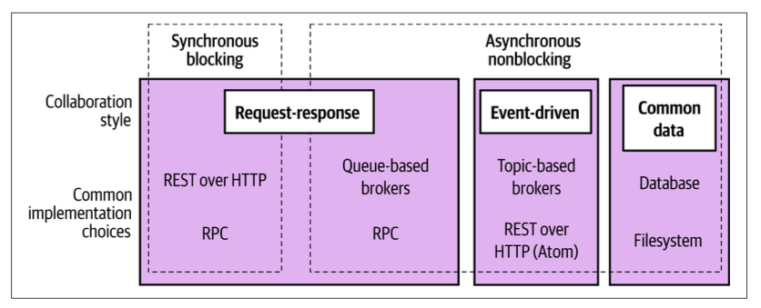

- Название: **"Создание микросервисов" (2-е издание)**
- Автор: **Сэм Ньюмен**
- Начало чтения: **xx.08.25**
- Конец чтения: **26.08.25**

Увидел упоминание этой книги в [посте](https://t.me/smthisgoingon/1512) Алексея Голобурдина ("Диджитализируй"). Решил ознакомиться, чтобы улучшить своё понимание идеи микросервисной архитектуры.

Книга мне не понравилась. Огромное количество воды и очень абстрактных рассуждений. Можно было спокойно сократить раза в полтора-два. 

Б**о**льшая часть информации для меня была не новой и воспринималась с мыслями "База. Очевидно. Зачем это так долго пояснять?".

Не понял, для кого написана книга. Для новичков? Тогда в ней слишком много советов, которые больше нужны синьерам/архитекторам/CTO, и вряд ли будут полезны условным джунам (про построение команд, про проектирование систем и т.д.). Для людей с опытом? Тогда в ней слишком много описаний базовых понятий и подходов, которые уже давно являются стандартом индустрии.

Ужасный перевод. Если вы, как и я были, были в шоке с перевода "coupling=сцепление" и "cohesion=связность", добро пожаловать в перевод С. Черникова. Тут "coupling=связанность" и "cohesion=связность". Каково, а? Очень удобно и главное всё понятно! Некоторые термины лучше вообще не переводить, чем переводить вот так. Во время чтения постоянно заглядывал в оригинал, чтобы понять, о чем вообще речь.

Несмотря на все эти минусы, отметил для себя несколько интересных мыслей (aka инсайтов), так что книга прочитана не зря.

**Как эта книга повлияла на мою жизнь:**
1. Микросервисы должны инкапсулировать в себе БЛ работы с данными. CRUD над БД — это плохой микросервис
2. Писать атрибуты лога отдельными json-полями, а не plain text в message
3. Понял отличие REST и RPC
4. Взаимодействие на базе очередей можно разделить на "запрос-ответ" и событийное. Не смешивать стили взаимодействия и реализацию
5. Не отделять тесты на код от команды, пишушей код
6. Mountebank
7. В CI/CD создается, тестируется и развертывается один и тот же артефакт
8. Архитектор ПО — градостроитель, а не архитектор-строитель

---
### Глава 1. Что такое микросервисы

Микросервисы — это про скрытие информации. Нужно как можно больше инкапсулировать внутри и как можно меньше выдавать наружу.

Не зацикливаться на размере микросервисов. Гораздо важнее — сколько вы сможете поддержать и как их правильнее спроектировать

Закон Конвея:

> Огранизации, разрабоатывающие системы, создают проекты, представляющие собой копии коммуникационных структур этих организаций

Монолит — это единица развертывания. Не воспринимать как что-то плохое по умолчанию.

1. Однопроцессный монолит. Классика
2. Модульный монолит. Состоит из модулей, но для развёртывания они объединяются
3. Распределённый монолит. Состоит из нескольких сервисов, которые должны разворачиваться одновременно.

Для поддержки микросервисов очень важны логи. Уметь агрегировать логи по одному запросу из нескольких микросервисов. Добавлять сквозные идентификаторы.

*Тут я осознал пользу записи доп. информации в логи виде отдельных json полей вместо plain text-а в "message". В системах агрегации логов по этим полям можно удобно грепать.*

Микросервисы — это не про экономию. Важная причина внедрения: разработчики могут не мешать друг другу.

### Глава 2. Как моделировать микросервисы

**L**ow Coup**li**ng && **H**igh Co**h**esion. Слабая связь между компонентами и высокая связь внутри каждого компонента.

Ограничить кол-во различных типов вызовов от одного сервиса к другому.

Если в системе нужен конечный автомат (статусная модель) только один сервис должен им управлять.

Микросервис, предоставляющий CRUD обертку над БД — это плохой микросервис. В таком случае логика управления данными будет размыта по другим сервисам. В сервисе должно быть много бизнес-логики, относящейся к хранимым данным.

DDD (Domain-Driven Design):

1. Единый язык: для нейминга в системе используем те же термины, что и в реальной жизни
2. Агрегат — то, что имеет идентичность, чем можно управлять. Объект из реального мира
3. Ограниченный контекст. В каждой области свои агрегаты (и они мб скрыты только в рамках этой области)

Наиболее благоприятный сценарий: один агрегат — один сервис. В начале можно "один контекст — один сервис".

**Event Storming:** люди от разработки и от бизнеса собираются и накидывают события на базе которых строится система. Потом выделяются агрегаты. Потом контексты

### Глава 3. Разделение монолита на части

Архитектура реально работающей системы никогда не бывает чистой или простой.

Настоящее мастерство заключается в том, чтобы привыкнуть к идее, что архитектура постоянно меняется.

### Глава 4. Стили взаимодействия микросервисов

Взаимодействие на основе очередей можно разделить на событийное и запрос-ответ.

- Событие — факт того, что что-то произошло, и мета-инфа (полезная нагрузка)
- Сообщение — то, что отправляем (средство)

### Глава 5. Реализация коммуникации микросервисов

IDL — Interface Definition Language

В REST самое важное — концепция ресурсов. *Тут осознал суть разницы между REST и RPC.* RPC — буквально API по структуре как вызов ф-ции. А в REST поверх HTTP есть метод HTTP, путь, ресурсы, query, заголовки и т.д.

https://protolock.dev/ — трекер обтратной совместимости для протобафов

GraphQL сложнее кэшировать. Очень хорош для чтения, хуже для записи. Лучшее место для GraphQL — по периметру системы, где предоставляется функциональность внешним клиентам.

В Kafka можно обрабатывать потоки через KSQL

XPATH — язык запросов для парсинга XML документов. jsonPATH — для JSON. Удобно для тестирования

Закон Постела:

> Относись консервативно к тому, что ты отправляешь и либерально к тому, что принимаешь

Важно обнаруживать обратно-несовместимые изменения в CI. Есть тулзы для этого. json-schema-diff-validator, openapi-diff

Confluent Schema Registry — сервис, который хранит схемы данных для Kafka.

Принцип DRY — это не про дублирование кода, а в первую очередь про дублирование системного поведения и знаний

**Service mesh.** Микросервисы работают только с проксями, которые развернуты у них под боком. Ничего не знают про другие микросервисы. А прокси взаимодействуют друг с другом и централизованно 
управляются. Имеет плюсы, но для больших систем

### Глава 6 Рабочий поток

Двухвазная фиксация (2PC two-phase commit) — один из вариантов распределённой транзакции.

1. Координатор запрашивает доступность изменений у исполнителей. Исполнители гарантируют, что если они дали ок, то в будущем внесут изменения. Блокируют запись. Если кто-то из исполнителей не дал ок, все посылается сигнал отката, они снимают блоки
2. Фаза фиксации. Координатор отправляет запросы, исполнители применяют изменения

В 2PC нет гарантии изоляции из ACID. Исполнители вносят изменния "потом" независимо друг от друга. 2PC для очень кратковременных операций, иначе все будут заблочены. Лучше избегать

**Саги.**

Нужные для восстановления после бизнес-сбоев (у покупателя на карте нет денег), а не технических сбоев (ответ 500 Internal Error)

Используют не только обратное восстановление (компенсирующие операции бизнес-логики), но и прямое (ретраи).

Откатываются за счет компенсирующих транзакций. Не всегда ровно отмена действия (отправка письма например), тут именно про логически обратное (отправка другого письма)

Лучше оптимизировать рабочий процесс так, чтобы наиболее рискованные шаги шли сначала. Чтобы нужно было меньше откатывать, если что

Реализация:
1. Оркестрованные — есть единый центр управления. Построены на взаимодействии "запрос-ответ" м/у оркестратором и подчиненными
2. Хореографические — нет единого центра. Построены на событийном взаимодействии

Проблемы оркестрованных:
1. Оркестратор знает про кучу сервисов, высокая связанность
2. Оркестратор может забирать часть логики сервисов => они становятся слабыми

### Глава 7. Сборка

Jenkins, CircleCI, TravisCI

> Интегрируйте рано и интегрируйте часто. Избегайте использования долгоживущих ветвей для разработки функций. Менее суток на одну ветвь, менее трёх активных ветвей

Артефакт:
1. Обычно создается после компиляции и прогона быстрых тестов
2. Создаем ровно один раз и в последующих шагах используем
3. Проверяемый артефакт — именно тот, который потом развертывается
4. Всё, что зависит от среды, должно быть вне артефакта

### Глава 8. Развертывание

FaaS — не думаем о серверах. Код триггерится на определенное событие, исполняется, и всё. Платформа обрабатывает перемещение вызовов. Хорошо для низкой или непредсказуемой нагрузки. Могут быть установлены лимиты по времени. Большинство ф-ций не имеют состояния

### Глава 9. Тестирование

Концепция исследовательского тестирования: а как систему можно сломать? Использовать автоматизацию тестирования, чтобы освободить время QA инженера на исследовательское тестирование

Неправильно дистанцировать команду от тестов на её код. Не выделять отдельные команды для написания и поддержки тестов

Тестовый конус (перевернутая пирамида) — антипаттерн

https://github.com/mountebank-testing/mountebank — тулза для создания моков внешних сервисов

**Контрактные тесты** — тесты взаимодействия двух сервисов (синк/асинк). https://habr.com/ru/companies/kuper/articles/845964/ — очень подробная статья про https://docs.pact.io/, тулзу для контрактных тестов

### Глава 10. От мониторинга к наблюдаемости

Мониторинг — деятельность. Наблюдаемость — свойство системы — насколько хорошо можно понять происходящее по внешним признакам

Кардинальность в timeseries БД — кол-во комбинаций значений полей. Каждая новая комбинация создает свой временной ряд. Promеtheus плохо работает с данными с высокой кардинальностью. Хранение самой метрики — дешево, хранение полей — дорого

### Глава 12. Отказоустойчивость

CAP-теорема:

- C — согласованность
- A — доступность
- P — устойчивость к разделению

Если связь между узлами прервалась, то AP — врём, но продолжаем работать, CP — не отвечаем. CA в реальности бессмысленные

Хаос-инжениринг: экспериментируем с системой и смотрим, что будет. Армия обезьян Netflix — сервисы ломающие систему различными способами (сетевые задержки и т. п.)

### Глава 13. Масштабирование

> Преждевременная оптимизация — корень всего зла (Дональд Кнут)

Интересный блок про кэширование:

- Можно кэшировать не только запросы к БД, но и запросы к внешним сервисам
- Кэш мб элементом надежности на случай падения кэшируемой части
- Кэширование — вынужденная оптимизация. Добавляет сложность, труднее определить актуальность данных

Интересный паттерн: событие "пульс" через очередь, чтобы проверить, что очередь жива.

### Глава 15. Организационные структуры

Закон Конвея + микросервисная арха приводят к выводу: если мы хотим получить слабосвязанную архитектуру, нужно создать слабосвязанную организацию

Обеспечение автономии команды — ключевой фактор. Профит в скорости принятия решений.

> Добавление рабочей силы к запаздывающему программному продукту делаем его ещё более запаздывающим (Фред Брукс)

### Глава 16. Эволюционный архитектор

Архитектор ПО — градостроитель, а не архитектор-строитель. Мыслит на уровне компонент системы и взаимодействии между ними, а не конкретной реализации. Либерально относится к тому, что происходит внутри.

https://12factor.net/

> Перемены неизбежны. Примите это.