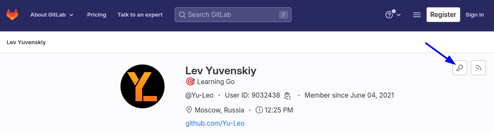

Изначально я хотел написать одну статью про использование gpg для подписи коммитов и ssh для доступа к удалённым репозиториям в git, однако первая часть получилась довольно объемной, поэтому я разделил всю информацию на две статьи.

В этой статье я расскажу о том, как и зачем **подписывать и верифицировать коммиты** в git.
## git - это база

Я предполагаю, что вы уже знакомы с системой контроля версий git и имеете некоторый опыт её использования: знаете, что такое коммит, как пушить в удалённый репозиторий и как настроить git через `git config` или редактирование конфигурационного файла. Если это не так - бегом изучать!


## Подпись коммитов

Цифровая подпись представляет собой процесс использования шифрования для добавления некоторой информации к подписываемым данным. Получатель таких данных может проверить достоверность подписи и убедиться в том, что сообщение пришло от указанного отправителя. Это похоже на использование обычной физической подписи, однако цифровая подпись имеет ряд преимуществ (в частности - более высокую надежность).

Git позволяет подписывать коммиты и теги цифровой подписью. У вас может возникнуть вопрос: "*Зачем мне что-то подписывать?! Я использую git уже n лет и у меня не возникает никаких проблем.*" Давайте разбираться!

### Зачем?!

Можно сказать, что коммиты в git основаны на доверии: предполагается, что в настройках `git config` вы указали свой адрес электронной почты и своё имя. *Но это ведь может быть не так?*

#### Один интересный пример

Рассмотрим историю коммитов одного из моих проектов на GitHub. Это не фотошоп и я не менял содержимое страницы через изменение кодов элементов.


Неужели Линус Торвальдс и Роберт Мартин приняли участие в этом проекте?! На первый взгляд действительно может так показаться, ведь даже если кликнуть по аватаркам, откроются их реальные профили на GitHub. Однако стоит присмотреться чуть внимательнее. Возле первого коммита, сделанного от моего имени, имеется зелёная надпись "Verified", а возле оставшихся трёх - нет. Почему?

Первый коммит действительно сделан и **подписан** именно мною, в файле `.gitconfig` были указаны мои имя и e-mail.

Второй и третий коммиты на самом деле были сделаны так же мною. Я всего лишь поменял в файле `~/.gitconfig` свои данные на чужие, после чего произвёл изменения в репозитории, закоммитил их и отправил на удалённый сервер. GitHub сам проассоциировал указанные в коммитах e-mail'ы с подлинными аккаунтами. Если выполнить команду `git log` в репозитории локально, эти два коммита также будут неотличимы от подлинных коммитов Линуса и Роберта.

Четвертый коммит сделан от моего имени, однако, так же как и предыдущие два, не имеет надписи "Verified". На самом деле этот коммит мог быть сделан кем угодно. Всё, что для этого требовалось - указать в настройках git'а мои данные (их можно легко узнать, выполнив команду `git log` в любом из моих репозиториев). Чтобы запушить такой коммит, например, на GitHub, злоумышленнику даже не нужно иметь доступ к моему аккаунту.

#### Ещё более интересный пример

Тут вы можете возразить: "*Ну и что такого страшного в том, что кто-то сделает какой-то коммит от моего имени? Кому какая разница?*". И по большей части будете правы. Но! Представьте, что такой коммит будет содержать изменения, добавляющие уязвимости или вредоносную функциональность в разрабатываемый вашей командой сервис. Если этот код обнаружится, виновным в его добавлении будут считать именно *вас*, поскольку коммит, которым и были внесены изменения, содержит *ваши* имя и e-mail. Подобная история довольно красочно описана в статье "[A Git Horror Story: Repository Integrity With Signed Commits](https://mikegerwitz.com/2012/05/a-git-horror-story-repository-integrity-with-signed-commits)". Рекомендую прочитать.

Именно поэтому я подписываю **ВСЕ** свои коммиты без исключения. Подпись коммита является доказательством того, что изменения, содержащиеся в нём, сделаны лично мной и никем другим. Отсутствие подписи - повод, как минимум, усомниться в авторстве коммита.

Возможно, такая забота о безопасности несколько избыточна. 
Например, можно подписывать только коммиты в важных репозиториях, над которыми ведётся совместная работа, и не подписывать в собственных pet-проектах (ведь в этом действительно нет практически никакой необходимости). Но, на мой взгляд, ситуация, в которой часть ваших коммитов подписана, а часть - нет, выглядит несколько странно. Если с подписанными коммитами вопросов не возникает, то нет абсолютно никакой гарантии, что не подписанные сделаны именно вами (ведь коммиты в других репозиториях вы всегда подписывали)? Я в этом вопросе придерживаюсь принципа "*Лучше перебдеть, чем недобдеть*".

Так как же всё-таки подписывать коммиты? В git для этого используется утилита `gpg`. Сначала я расскажу немного о ней самой, без привязки к подписи коммитов. Если вы уже знакомы с данной утилитой, можете пропустить следующий раздел.

## Пару слов про gpg

Что за зверь такой?

[GPG (GnuPG)](https://www.gnupg.org/) - утилита с открытым исходным кодом, позволяющая шифровать и подписывать данные. Может использоваться как для симметричного, так и для ассиметричного шифрования информации.

**Ключ** - секретная информация, используемая криптографическим алгоритмом при шифровании/расшифровке сообщений, постановке и проверке цифровой подписи, вычислении кодов аутентичности ([wikipedia.org](https://ru.wikipedia.org/wiki/%D0%9A%D0%BB%D1%8E%D1%87_(%D0%BA%D1%80%D0%B8%D0%BF%D1%82%D0%BE%D0%B3%D1%80%D0%B0%D1%84%D0%B8%D1%8F))).

При симметричном шифровании для шифровки и расшифровки используется один ключ.

При ассиметричном шифровании используются 2 ключа - публичный и приватный. Публичный используется для шифрования, приватный - для расшифровки.

Далее рассмотрим примеры практического использования этой утилиты **в терминале Linux** (версия gpg 2.2.41).

В большинстве дистрибутивов Linux gpg установлена по умолчанию. Если в вашей системе она отсутствует, необходимо будет скачать пакет `gnupg` с помощью пакетного менеджера либо собрать его из [исходников](https://github.com/gpg/gnupg).

### Генерация новой пары ключей

Сначала необходимо сгенерировать пару ключей (приватный и публичный), которые будут использоваться для шифрования/дешифрования или подписи данных, следующей командой:

```shell
gpg --full-generate-key
```

Далее нужно будет указать:
1. Тип шифрования
2. Размер ключа в битах
3. Срок действия ключа (либо отсутствие такового)
4. Идентификатор пользователя (имя, e-mail, примечание)
5. Фразу-пароль

После чего gpg сгенерирует и добавит в "связку" новую пару ключей.

При дальнейших операциях (например, [экспорте](#экспорт-ключей)) для идентификации ключа можно будет использовать как его Id, так и информацию о владельце ключа (имя или e-mail).

### Вывод списка ключей

Полезно для отслеживания списка ключей, находящихся в системе.

Вывод списка **публичных** ключей:
```shell
gpg --list-keys
```

либо сокращённый вариант:
```shell
gpg -k
```

Вывод списка **приватных** ключей:
```shell
gpg --list-secret-keys
```

либо сокращённый вариант:
```shell
gpg -K
```

### Экспорт ключей

Для того чтобы ключами можно было поделиться (например, указать их на github), забэкапить, и т. д., их необходимо экспортировать. 

Экспорт **публичного** ключа в текстовом формате:
```shell
gpg --export -a test@test.ru > public.gpg
```

Экспорт **приватного** ключа в текстовом формате:
```shell
gpg --export-secret-key -a test@test.ru > secret.gpg
```

При помощи флага `-a` (`--armor`) указываем, что экспортировать ключ необходимо в текстовом (ASCII) формате. При отсутствии данного флага будет использован бинарный формат.

### Удаление ключей

Если вы хотите удалить и приватный и публичный ключи, соответствующие одному идентификатору, **сначала необходимо удалить приватный!**

Удаление **приватного** ключа:
```shell
gpg --delete-secret-keys test@test.ru
```

Удаление **публичный** ключа:
```shell
gpg --delete-keys test@test.ru
```

### Импорт ключей

Если вы ранее экспортировали свои ключи в файлы либо же с вами поделились ключами в виде файлов, вы можете импортировать их при помощи следующих команд.

Импорт **публичного** ключа из файла `public.gpg`:
```shell
gpg --import public.gpg
```

Импорт **приватного** ключа из файла `secret.gpg`:
```shell
gpg --import secret.gpg
```

Очевидно, можно импортировать отдельно только публичный ключ. Это может быть необходимо, например, для проверки подписей, о чем я расскажу далее.

### Настройка gpg-agent

Для удобства использования gpg можно немного настроить [gpg-agent](https://man.archlinux.org/man/gpg-agent.1) - демон для управления приватными ключами.

Сначала нужно добавить в файл инициализации, который используется для вызова командной оболочки (`~/.bashrc`, `~/.zshrc` или другой), следующие строки:

```bash
GPG_TTY=$(tty)
export GPG_TTY
```

Задать время, в течение которого можно пользоваться секретными ключами без ввода фразы-пароля, можно путём добавления следующих настроек в файл `~/.gnupg/gpg-agent.conf`:

```bash
max-cache-ttl 0
default-cache-ttl 0
```

где вместо `0` необходимо указать желаемое время в секундах.

Из [документации](https://man.archlinux.org/man/gpg-agent.1#OPTIONS):
- `default-cache-ttl` задаёт время действия записи в кэше равным `n` сек. Каждый раз, когда осуществляется доступ к записи в кэше, таймер записи сбрасывается. Значение по умолчанию - 600 секунд (10 минут).
- `max-cache-ttl` задаёт максимальное время действия записи в кэше равным `n` секундам. По истечении этого времени срок действия записи в кэше истечет, даже если к ней недавно обращались. Значение по умолчанию - 7200 секунд (2 часа).

### Использование gpg для шифрования данных

Поскольку рассмотрение вопросов, связанных с шифрованием данных, не является целью этой статьи, я приведу лишь небольшой ознакомительный пример.

1. Пускай имеется файл `secret.txt` со следующим содержимым, который необходимо зашифровать:
```
login: login
password: my_secret_password
```

2. Зашифруем его при помощи ключа проассоциированного с эл. почтой `test@test.ru`:
```shell
gpg -e -a -r test@test.ru file.txt
```

3. Получим файл `secret.txt.asc`:
```
-----BEGIN PGP MESSAGE-----

hQIMA+AExcP7onIcARAAnl4StEBnRfhmOdi+MrSMzFnSk4bbyNS+OfNJui69UQ0w
++xA4d5LIpPD1uhnELzldTKlLlNmO1KBq2KeH9hWJ3DrNl3HzoPqEYE4+FMtWuag
Dc7LdWDiHqP0PyIOaMEJzkX3LDz78enRCwQqMGVR0x7EK6sWJUrKGHasYS9prg0k
PSD+1nykDvUK7rX7GCnVEKDBXsGaN1uhMt/Qn0kVReKbNhTO7O1BAJoMc22tf+IB
BSQkIDDTsvYsEIzVbq4PRlR+4PMbxaZY1pL9EwBXQHmgoJ62UUgxYNiHAlc3eeBB
VGjDHTrqGieVBZ2pkpgZ83QJ52b8q3BozM9Pl/LIX7/+r+ilGF3rCydV1Z8qBrCZ
fauTAwJKgwL6J+W0x3OIQY5gfrk66Bfvxa1wXZbPYuyRQeLQ+QYqhUwAtc9qkyUb
LExYuzCrItqJbMpVio0dlXPqCIF1iAoH5WQ3idcSWaMe41j6z4z9qK2qNfgcPpfr
Lovf29hhl3kHrZJaiBSWZsYN1xKl7hEyvOH+uLaI0OmFo/rwB7oR0i05x6rjz8m6
VZFL2L2Y3qGPOdxjeOvyDcQEtDtFhBMiKfTuQ2RO2tXzjgatDp7hOeSgLHU2QU32
mRZkhPOZZ0Hi/bgYtpQpOPYE5UUuFdwDEn3foD1BHWe7xvAPZI3LyGXxr1ZKKQTS
YQHlpfethBqhSosuLwiZA91l1bziZv2iRE7Xbp/Oq3hWBjV8UlzLK2eXas1OaxJP
DySQ08B733XUUWlrIJwQhpjBjK5pFPNNMSfxBhC1d4krTW98AaEYBGJlZb+Web9N
VmM=
=i0EM
-----END PGP MESSAGE-----
```

Как можно заметить, данные, содержащиеся в исходном файле, действительно были зашифрованы.

4. В дальнейшем этот файл может быть расшифрован при помощи команды
```shell
gpg -d -o secret-2.txt secret.txt.asc
```

После её выполнения файл `secret-2.txt` будет иметь то же содержимое, что и исходный файл `secret.txt`.

## Вернёмся к подписи коммитов 

Теперь рассмотрим конкретные шаги, которые необходимо выполнить, чтобы начать подписывать коммиты в git при помощи gpg.

#### Генерируем ключи

Если у вас уже имеются ключи, которые вы хотите использовать для подписи коммитов, - отлично! Если ключей нет, их необходимо будет сгенерировать:

```shell
gpg --full-gen-key
```

1. Тип ключа: **1** (**"RSA and RSA"**).
2. Размер ключа: **4096**.
3. Срок действия ключа вы можете определить самостоятельно. Значение по умолчанию - 0 (срок действия не ограничен).
4. Подтверждаем введённые данные.
5. Вводим имя и e-mail автора ключа. Примечание можно указать по желанию.
6. Подтверждаем введённые данные.
7. Вводим фразу-пароль.


#### Настраиваем git

**1. Добавляем Id ключа в конфиг git'а**

Далее в настройках git'а необходимо указать, какой именно ключ будет использоваться для подписи коммитов и тегов. Сделать это можно командой:

```shell
git config --global user.signingkey D8A09476209E70FECC308704C8150A1C4AB47C3C
```

где вместо `D8A09476209E70FECC308704C8150A1C4AB47C3C` нужно указать Id ключа, который вы хотите использовать для подписи коммитов.

**2. Включаем автоматическую подпись коммитов**

Каждый отдельный коммит можно подписывать вручную, указывая флаг `-s` при выполнении команды `git commit`.

Если вы хотите, чтобы git автоматически подписывал **каждый** коммит, необходимо задать параметру `commit.gpgsign` значение `true`:

```shell
git config --global commit.gpgsign true
```

Выполнение команд из шагов **2** и **3** добавит в глобальный конфигурационный файл git'а следующие настройки (вместо `D8A09476209E70FECC308704C8150A1C4AB47C3C` будет указан Id вашего ключа): 

```
[user]
    signingkey = D8A09476209E70FECC308704C8150A1C4AB47C3C

[commit]
    gpgsign = true
```

Для осуществления подписи коммита gpg потребует от вас фразу-пароль, заданную при генерации соответствующего ключа.

#### Ошибка "gpg failed to sign the data"

При попытке сделать коммит после выполнения всех описанных выше настроек вы можете столкнуться со следующей ошибкой:

```
error: gpg failed to sign the data
fatal: failed to write commit object
```

Решение данной проблемы я описал [тут](https://github.com/Yu-Leo/knowledge-base/blob/main/about-gpg/gpg_failed_to_sign_the_data.md).

#### Добавление ключа на GitHub

Для того чтобы GitHub/GitLab/<иной сервис> мог автоматически верифицировать ваши коммиты, необходимо указать на нём ключ (или ключи, если их несколько), который(-е) вы будете использовать для подписи коммитов. Я рассмотрю эту процедуру на примере GitHub. Во всех остальных сервисах действия будут аналогичными.

Для начала необходимо экспортировать публичный ключ в текстовом формате в файл:

```shell
gpg --export --armor D8A09476209E70FECC308704C8150A1C4AB47C3C > ./gpg-key.pub
```

После чего содержимое файла `gpg-key.pub` нужно будет указать в настройках вашего аккаунта на используемом сервисе.

На github.com данная процедура делается следующим образом:

1. Переходим в **"Settings"** -> **"SSH and GPG keys"** ([прямая ссылка](https://github.com/settings/keys)).
2. Нажимаем кнопку **"New GPG key"**.
3. Вставляем содержимое файла в поле **"Key"**.
4. Нажимаем кнопку **"Add GPG key"**.

Готово!

Теперь около подписанных соответствующим ключом коммитов будет отображаться заветная зелёная надпись **"Verified"**.


Аналогично на GitLab:


Более того, после добавления своего ключа на GitHub вы можете включить режим бдительности (vigilant mode). В нём все не подписанные или подписанные ключом, отсутствующем в вашем профиле, коммиты будут помечаться желтой надписью **"Unverified"**. Более подробно об этом режиме написано в [документации](https://docs.github.com/en/authentication/managing-commit-signature-verification/displaying-verification-statuses-for-all-of-your-commits).


В таком случае история коммитов из [примера выше](#один-интересный-пример) будет выглядеть так:


### Полезные ссылки

- Статья "[Подпись коммитов в Git: как и зачем это делать](https://techrocks.ru/2021/06/14/commit-signing-in-git/)"
- StackOverflow "[Как подписать предыдущие коммиты](https://stackoverflow.com/questions/13043357/git-sign-off-previous-commits)"
- StackOverflow "[Поменять у автора и коммитера e-mail и имя во всех коммитах](https://ru.stackoverflow.com/questions/763153/%D0%9F%D0%BE%D0%BC%D0%B5%D0%BD%D1%8F%D1%82%D1%8C-%D1%83-%D0%B0%D0%B2%D1%82%D0%BE%D1%80%D0%B0-%D0%B8-%D0%BA%D0%BE%D0%BC%D0%BC%D0%B8%D1%82%D0%B5%D1%80%D0%B0-%D0%B5%D0%BC%D0%B5%D0%B9%D0%BB-%D0%B8-%D0%B8%D0%BC%D1%8F-%D0%B2%D0%BE-%D0%B2%D1%81%D0%B5%D1%85-%D0%BA%D0%BE%D0%BC%D0%BC%D0%B8%D1%82%D0%B0%D1%85)"
- StackOverflow "[Каковы преимущества и недостатки криптографической подписи коммитов и тегов в Git? ](https://softwareengineering.stackexchange.com/questions/212192/what-are-the-advantages-and-disadvantages-of-cryptographically-signing-commits-a)"

## Проверка подписи локально

Помимо проверки подписей на сервисах для хостинга проектов, очевидно, данную операцию можно произвести и локально в терминале. Думаю, лучше всего продемонстрировать её на практических примерах. Если хотите, можете повторять описываемые действия в своём терминале параллельно с чтением этой статьи.

### Проверка собственной подписи

1. Создадим пару gpg-ключей и настроим git согласно инструкциям, описанным выше.
2. Создадим директорию, в которой будем экспериментировать, и инициализируем в ней git-репозиторий:
```shell
mkdir test-gpg
cd test-gpg
git init
```
3. Произведём какие-нибудь изменения в этом репозитории. Например, так:
```shell
echo "Some text" > ./1.txt
```
4. Закоммитимся (git попросит вас ввести фразу-пароль от gpg-ключа):
```shell
git add 1.txt
git commit -m "Test commit"
```

Готово! Мы создали и подписали коммит. Но как теперь проверить, действительно ли наш коммит подписан? Команды `git log` или `git show` по умолчанию не расскажут нам ничего о подписях. Для этого нужно будет выполнить команду

```shell
git verify-commit commit-hash
```

где вместо `commit-hash` указать хеш коммита, подпись которого необходимо верифицировать. Также тут можно использовать указатель `HEAD` и указатели на ветки.

В ответ получим сообщение следующего рода:

```
gpg: Подпись сделана Вт 08 авг 2023 18:33:05 MSK
gpg:                ключом RSA с идентификатором B11DCA1EB7A70C59310D96CFADA1AE8105F45272
gpg: Действительная подпись пользователя "Lev Yuvenskiy <levayu22@gmail.com>" [абсолютное]
```

Таким образом мы убедились в том, что коммит действительно подписан нужной подписью. Если же "натравить" команду `git verify-commit` на не подписанный коммит, она не выведет в консоль ничего.

Помимо этого можно настроить отображение информации о подписи коммитов через `git log --pretty=format:'...'`. Вывод команды `git log` по умолчанию не очень удобен, поэтому многие пользователи назначают алиас с кастомным форматом вывода в конфигурации git'а. Мой алиас выглядит следующим образом ([весь файл конфигурации](https://github.com/Yu-Leo/knowledge-base/blob/main/configs/git-config/.gitconfig)):
```
[alias]
  hist = log --graph --pretty=format:'%Cred%h%Creset -%C(yellow)%d%Creset %s %Cgreen(%cr) %C(bold blue)<%an> %G?'%Creset --abbrev-commit --date=relative
```

где плейсхолдер `%G?` как раз и отвечает за отображение "флага подписи" коммита ([документация](https://git-scm.com/docs/pretty-formats#Documentation/pretty-formats.txt-emGem)):
- `G` - валидная подпись
- `B` - невалидная подпись
- `U` - валидная подпись с неизвестным сроком действия
- `X` - валидная подпись с истёкшим сроком действия
- `Y` - валидная подпись, сделанная ключом с истёкшим сроком действия
- `R` - валидная подпись, сделанная отозванным ключом
- `E` - подпись не может быть проверена (например, отсутствует ключ) 
- `N` - отсутствие подписи

Вывод истории коммитов при помощи этого алиаса выглядит следующим образом:


### Проверка чужой подписи

Даже если вы не подписываете свои коммиты, возможно, вы захотите проверить подлинность чужих коммитов. Я рассмотрю эту процедуру на примере одного из моих репозиториев.

P.S. Для наглядности я удалил из своей системы ключи, которые ранее использовал для подписи коммитов в этом репозитории.

**1. Клонируем репозиторий.**
```shell
git clone https://github.com/Yu-Leo/Yu-Leo.git test-dir
cd test-dir
```
**2. Верифицируем один из коммитов.**
```shell
git verify-commit e5c3f38
```

В ответ получим следующее сообщение:
```
gpg: Подпись сделана Ср 09 авг 2023 13:19:30 MSK
gpg:                ключом RSA с идентификатором DD1CAFC4AAE9A5FBC98913B491E4DDCE2AD6A7D8
gpg: Не могу проверить подпись: Нет открытого ключа
```

Как можно заметить, в нём присутствует Id ключа, которым был подписан коммит, однако gpg не смог проверить подпись и установить её автора.

Для того чтобы получить полную информацию о подписи, необходимо импортировать **публичный** ключ, соответствующий указанному идентификатору. Где его взять? Очевидно, у автора ключа. Некоторые пользователи выкладывают свои публичные ключи, чтобы кто угодно мог верифицировать их подписи. Например, если вы импортируете репозиторий с gitlab.com и автор коммита указал свой gpg-ключ в настройках, вы можете получить его, нажав на иконку ключа в профиле:



В моём случае необходимый gpg-ключ лежит в репозитории, который мы клонировали ранее. Дело в том, что этот репозиторий является не совсем обычным: содержащийся в нём `README.md` файл отображается GitHub'ом в [моём профиле](https://github.com/Yu-Leo). В свою очередь эта ридмишка содержит в себе ссылки на мои публичные gpg-ключи. Их можно посмотреть и скачать, кликнув на соответствующие значки.


**3. Импортируем ключ из файла.**

```shell
gpg --import ./gpg-personal.gpg
```

**4. Повторно верифицируем коммит. Получаем сообщение:**

```
gpg: Подпись сделана Ср 09 авг 2023 13:19:30 MSK
gpg:                ключом RSA с идентификатором DD1CAFC4AAE9A5FBC98913B491E4DDCE2AD6A7D8
gpg: Действительная подпись пользователя "Lev Yuvenskiy <levayu22@gmail.com>" [неизвестно]
gpg: Внимание: Данный ключ не заверен доверенной подписью!
gpg:           Нет указаний на то, что подпись принадлежит владельцу.
Отпечаток первичного ключа: DD1C AFC4 AAE9 A5FB C989 13B4 91E4 DDCE 2AD6 A7D8
```

Оно содержит имя и e-mail автора ключа, однако вместе с тем в нём появились подозрительные фразы "Данный ключ не заверен доверенной подписью!" и "Нет указаний на то, что подпись принадлежит владельцу." На самом деле коммит действительно был корректно подписан, а эти слова говорят лишь о том, что ключ, использованный для подписи, не входит в число тех, которым доверяете *вы*.

**5. Добавляем импортированный ключ в доверенные.**
```shell
gpg --edit-key key-id
```

где `key-id` - Id того ключа, который необходимо отредактировать (в нашем случае - `DD1CAFC4AAE9A5FBC98913B491E4DDCE2AD6A7D8`)

Вводим команду `trust`, после чего выбираем пункт `5` (абсолютное доверие), подтверждаем свои намерения и выходим из режима редактирования, введя команду `quit`.

P.S. Когда мы верифицировали сделанный нами же коммит, данная процедура не требовалась, поскольку сгенерированная пара ключей по умолчанию имеет абсолютное доверие. Подробнее об уровнях доверия ключей написано в [документации](https://www.gnupg.org/gph/en/manual/x334.html). 

**6. В очередной раз выполняем `git verify-commit e5c3f38` и получаем желаемое сообщение:**

```
gpg: Подпись сделана Ср 09 авг 2023 13:19:30 MSK
gpg:                ключом RSA с идентификатором DD1CAFC4AAE9A5FBC98913B491E4DDCE2AD6A7D8
gpg: проверка таблицы доверия
gpg: marginals needed: 3  completes needed: 1  trust model: pgp
gpg: глубина: 0  достоверных:   1  подписанных:   0  доверие: 0-, 0q, 0n, 0m, 0f, 1u
gpg: Действительная подпись пользователя "Lev Yuvenskiy <levayu22@gmail.com>" [абсолютное]
```

**Всё!** Таким образом мы полностью убедились в том, что данный коммит действительно принадлежит указанному автору.

#### Подпись GitHub'а

Если выполнить команду `git hist` (мой алиас для команды `git log`, о котором я рассказывал выше), то следующие 4 коммита перед рассматриваемым (`e5c3f38`) будут иметь "флаг подписи" `E` (подпись не может быть проверена). Дело в том что они были сделаны мною непосредственно на сайте github.com через графический интерфейс. Такие коммиты GitHub автоматически подписывает [своим ключом](https://github.com/web-flow.gpg). Вы можете импортировать его командой

```shell
curl https://github.com/web-flow.gpg | gpg --import
```

после чего все коммиты, подписанные GitHub'ом будут иметь флаг `U` (валидная подпись с неизвестным сроком действия). Если же добавить этот ключ в доверенные, значение сменится на `G` (валидная подпись). Т. е. коммиты, сделанные на сайте github.com, будут приравнены к коммитам, подписанным авторским ключом.

## Автоматическая проверка подписей

Конечно, просматривать подпись каждого коммита вручную - занятие крайне утомительное. Гораздо быстрее верифицировать авторство коммитов автоматически.

С помощью флага `--verify-signatures` можно заставить команды `git merge` и `git pull` проверять наличие и валидность gpg-подписей у коммитов. В случае, если сливаемая ветка будет содержать не подписанные или некорректно подписанные коммиты, слияние не будет произведено.

На GitHub в настройках репозитория (**Settings -> Rules -> Rulesets**) можно добавить автоматическую проверку на наличие валидной подписи у всех коммитов, отправляемых в определённую ветку:


Если вы решите использовать такую проверку при совместной разработке, вам необходимо будет убедиться в том, что все члены команды понимают, что такое подпись коммитов, зачем она нужна, а так же (очевидно) подписывают свои коммиты.
## Выводы

Подписывать коммиты в git - важно! Рекомендую вам начать придерживаться данной практики, если вы не делали этого ранее. Надеюсь, статья была полезна для вас.
