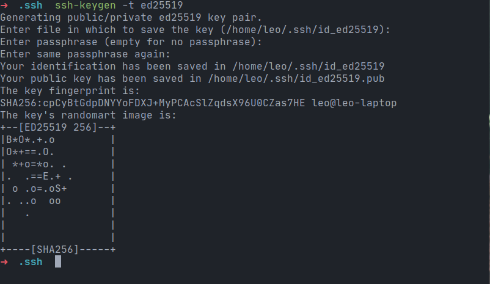
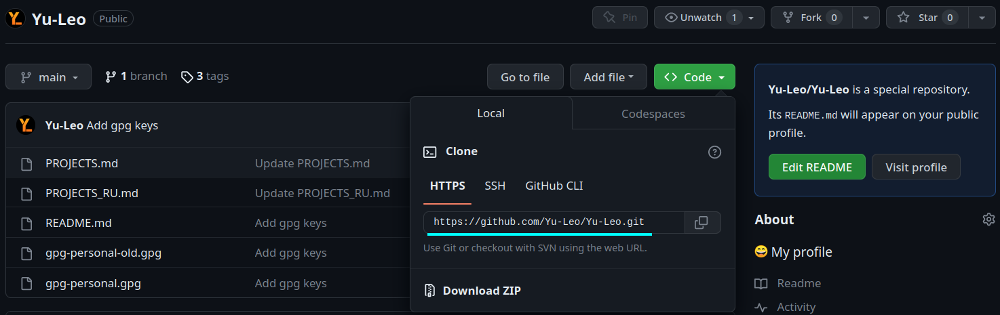
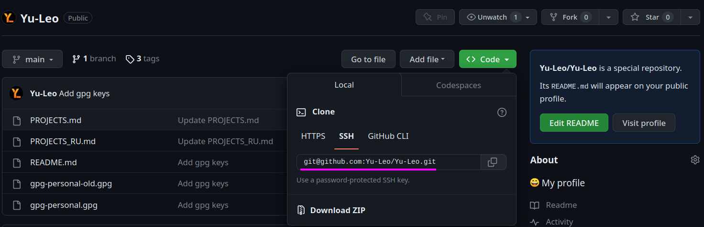

Предыдущая статья была посвящена "связке" `git` + `gpg`. В этой же речь пойдёт о том, как при помощи протокола **ssh** удобно и безопасно работать с удалёнными git-репозиториями.

## Кто этот ваш ssh?


SSH (Secure SHell) - это сетевой протокол, посредством которого два компьютера могут взаимодействовать и обмениваться данными. Важно, что данные при этом шифруются, поэтому протокол ssh считается безопасным.

С помощью ssh можно подключаться к удаленным серверам, выполнять на них команды, копировать и редактировать файлы.

Пакет `openssh` входит в большинство дистрибутивов Linux по умолчанию. Если по какой-либо причине он отсутствует в вашей системе, вы можете установить его при помощи вашего пакетного менеджера.

## Доступ к удалённым репозиториям

### Зачем?

С 13 августа 2021 года GitHub убрал возможность использовать личный пароль для получения доступа к репозиториям по https из терминала. Вместо пароля от аккаунта на github.com при выполнении команд `git clone`, `git fetch`, `git pull`, или `git push` теперь необходимо указывать персональный токен доступа. Такое решение было принято с целью защиты пользователей и предотвращения использования злоумышленниками похищенных или взломанных паролей.

На мой взгляд, доступ к удалённым репозиториям по https (не важно - по паролю или по токену доступа) проигрывает в удобстве и гибкости доступу по ssh. При этом настройка подключения по ssh займёт у вас совсем немного времени - возможно, даже меньше, чем уйдёт на то, чтобы разобраться с токенами в GitHub. Именно поэтому я перешёл на использование ssh для всех удалённых репозиториев (расположенных не только на GitHub) даже раньше, чем GitHub перешёл на использование токенов вместо паролей.

### Как? 

Теперь рассмотрим конкретные шаги, которые необходимо выполнить, чтобы настроить работу с удалёнными репозиториями при помощи ssh. Я буду показывать все действия **в терминале Linux**.

#### Получаем ssh-ключи

Если у вас уже имеется пара ключей, которые вы хотите использовать для доступа к удалённым репозиториям, убедитесь, что файл с **приватным** ключом имеет права доступа `rw-------`  и при необходимости установите их командой:

```shell
chmod 600 ~/.ssh/personal_key
```

Если у вас ещё нет пары ssh-ключей (приватного и публичного), их необходимо сгенерировать при помощи утилиты `ssh-keygen`.

```shell
ssh-keygen -t ed25519
```

Через флаг `-t` задаём алгоритм, на основе которого будут сгенерированы ключи. [GitHub](https://docs.github.com/en/authentication/connecting-to-github-with-ssh/generating-a-new-ssh-key-and-adding-it-to-the-ssh-agent#generating-a-new-ssh-key), [GitLab](https://docs.gitlab.com/ee/user/ssh.html) и [Yandex](https://cloud.yandex.ru/docs/glossary/ssh-keygen#kak-sgenerirovat-klyuch-ssh) рекомендуют использовать `ed25519`.

Название файла, в который будет сохранён ключ, можно оставить дефолтным.

Далее по желанию можно задать пароль на генерируемый ключ. Если вы сделаете это, ssh будет требовать его при каждом использовании ключа. Чтобы не вводить пароль *каждый* раз, можно немного настроить [ssh-agent](https://www.ssh.com/academy/ssh/agent) - менеджер ключей для ssh.



После чего в терминал будет выведено "изображение" вашего ключа из ASCII-символов (красивое), а в папке `~/.ssh/` появятся два файла: `id_ed25519` и `id_ed25519.pub` с приватным и публичным ключами соответственно. Для удобства работы эти файлы можно переименовать:

```shell
mv ~/.ssh/id_ed25519 ~/.ssh/personal_key
mv ~/.ssh/id_ed25519.pub ~/.ssh/personal_key.pub
```

#### Настраиваем ssh config

Чтобы ssh мог автоматически использовать правильные ключи при работе с удалёнными репозиториями, необходимо задать некоторые настройки. А именно - добавить в файл `~/.ssh/config` следующие строки:

```bash
Host github.com
    HostName github.com
    User git
    IdentityFile ~/.ssh/personal_key
    IdentitiesOnly yes
```

где:
- `gihub.com` - url сервиса, с которым будем работать (указываем одинаковым в `Host` и `HostName`).
- `~/.ssh/personal_key` - путь до файла с **приватным** ключом, который необходимо использовать для подключения.

Очевидно, аналогичные настройки можно произвести не только для GitHub'a, но и для иных сервисов (например, GitLab'a), добавив соответствующие строки в файл конфигурации.

#### Указываем публичный ключ на GitHub

Для того чтобы GitHub (или иной сервис) мог авторизовать ваше подключение, необходимо указать в настройках аккаунта **публичный** ssh-ключ, который вы будете использовать для доступа к репозиториям (также можно указать несколько ключей).

На github.com эта процедура делается следующим образом:

1. Переходим в **"Settings"** -> **"SSH and GPG keys"** ([прямая ссылка](https://github.com/settings/keys)).
2. Нажимаем **"New SSH key"**.
3. В поле **"Key"** вставляем содержимое файла `personal_key.pub` (либо `id_ed25519.pub`, если вы не переименовывали файлы).
4. Нажимаем **"Add SSH key"**.

Во всех остальных сервисах действия будут аналогичными.

При первом подключении по ssh необходимо будет добавить github.com (либо адрес того сервиса, который вы используете) в список доверенных хостов:

```
The authenticity of host 'github.com (140.82.121.4)' can't be established.
RSA key fingerprint is SHA256:nThbg6kXUpJWGl7E1IGOCspRomTxdCARLviKw6E5SY8.
This key is not known by any other names
Are you sure you want to continue connecting (yes/no/[fingerprint])? yes
Warning: Permanently added 'github.com' (RSA) to the list of known hosts.
Everything up-to-date
```

**Готово!** Теперь вы можете использовать ssh для доступа к удалённым репозиторям.

Имейте в виду, что при использовании протокола ssh пути до ваших удалённых репозиториев будет отличаться от путей, которые соответствовали протоколу https. Чтобы склонировать репозиторий с GitHub по ssh, вам нужно будет выбрать вкладку "ssh" в меню клонирования репозитория, после чего использовать указанный путь аналогично обычному "https-пути" (например, указать в качестве аргумента команды `git clone`).





### Как сменить адрес удалённого репозитория

Если у вас уже есть репозиторий, синхронизация которого с удалённым сервером происходила по протоколу https, а теперь вы хотите использовать ssh, вам необходимо будет сменить адрес удалённого репозитория, выполнив следующую команду в локальном репозитории:

```shell
git remote set-url origin git@serviceurl:username/reponame.git
```

где:
- `serviceurl` - url сервиса, на котором находится удалённый репозиторий (например, `github.com` или `gitlab.com`).
- `username` - ник владельца репозитория.
- `reponame` - название репозитория.

Проверить, что изменения прошли корректно, можно путём выполнения команды

```shell
git remote -v 
```

в локальном репозитории. Если в выводе содержатся строки вида:

```
origin	git@serviceurl:username/reponame.git (fetch)
origin	git@serviceurl:username/reponame.git (push)
```

с путями до вашего удалённого репозитория, значит, всё сделано правильно.

## Полезные ссылки

- Видео "[Как правильно настроить SSH для GitHub / GitLab](https://youtu.be/R09UNc4ZNi4)"
- Статья "[Как работать с несколькими GitHub-аккаунтами на своей локальной машине](https://techrocks.ru/2020/12/24/how-to-manage-several-github-accounts/)"
- Статья "[Как эффективно работать с несколькими SSH-ключами](https://techrocks.ru/2020/02/26/multiple-ssh-keys-managing/)"
- Статья "[Протокол SSH и авторизация с помощью ключей](https://cloud.yandex.ru/docs/glossary/ssh-keygen)"
- GitHub docs: "[Connecting to GitHub with SSH](https://docs.github.com/en/authentication/connecting-to-github-with-ssh)"

## Выводы

Используйте протокол ssh для доступа к удалённым git-репозиториям. Это безопасно и удобно!
