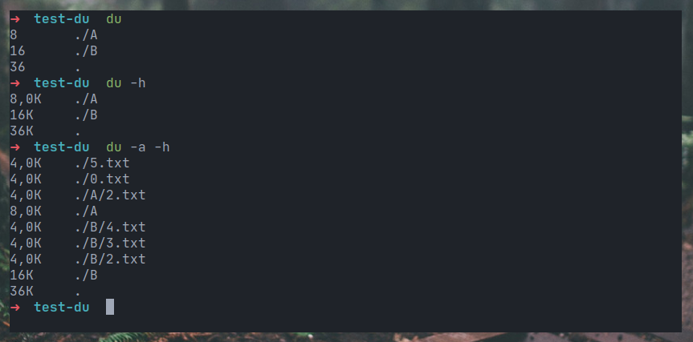

Хочу сделать подборку полезных терминальных Linux-утилит. Для удобства я разбил весь список на несколько частей. Это первая статья из цикла, и в ней я рассмотрю утилиты, предназначенные для мониторинга различных параметров системы.

## htop

`htop` - современный аналог утилиты [`top`](https://losst.pro/komanda-top-v-linux). Отображает информацию о нагрузке на систему в удобном формате, а так же позволяет управлять запущенными процессами.

[Подробнее об утилите **htop**](https://manpages.ubuntu.com/manpages/focal/man1/htop.1.html).

## bottom

[`bottom`](https://github.com/ClementTsang/bottom) - утилита, отображающая информацию о состоянии системы (нагрузка на CPU, кол-во занятой и свободной оперативной памяти, данные с датчиков температуры, загруженность дисков и т д), а так же строящая по этим данным графики.

## free

`free` - утилита, выводящая информацию об использовании оперативной физической и swap- памяти.

По умолчанию все значения указаны в байтах. Команду удобно использовать с флагами `-h` (human) - для вывода в удобочитаемом формате и `-t` (total) - для вывода строчки с суммарными значениями.

Так же у неё есть интересный флаг `-s n`, при использовании которого данные об использовании оперативной памяти будут выводиться каждые `n` секунд. Остановить процесс можно сочетанием горячих клавиш `Ctrl + c`.

[Подробнее о команде **free**](https://unetway.com/blog/free-komanda-v-linux).

## df | duf

### df (**d**isk **f**ree)

`df` - утилита, выводящая список подключенных устройств, информацию о использовании места на дисках, а также точки монтирования.

По умолчанию все значения указаны в килобайтах. Команду удобно использовать с флагом `-h` (human) для вывода в удобочитаемом формате.

[Подробнее о команде **df**](https://losst.pro/komanda-df-linux).

### duf (disk usage/free)

[`duf`](https://github.com/muesli/duf) - современный аналог команды `df`, имеющий более приятный и удобочитаемый вывод.

## du | dust | ncdu

### du (**d**isk **u**sage)

`du` - утилита, выводящая список файлов и директорий в заданной директории.

Некоторые опции:
- `-h` - выводить размеры в удобочитаемом формате
- `-a` - выводить не только директории, но и файлы

[Подробнее о команде **du**](https://losst.pro/komanda-du-v-linux)

### dust (du + rust = dust)

[`dust`](https://github.com/bootandy/dust) - современный аналог `du`, имеющий более приятный и удобочитаемый вывод.

### ncdu (ncurses disk usage)

`ncdu` - утилита c псевдографическим интерфейсом, отображающая список файлов и директорий в данной директории, по умолчанию отсортированных по убыванию размера. При необходимости можно отсортировать файлы в удобном порядке (по размеру, по имени и т. д.), перейти в поддиректории, а так же сразу удалить ненужные файлы и директории. 

Довольно полезная утилита для поиска файлов и директорий, занимающих больше всего места на диске.

[Подробнее об утилите **ncdu**](https://manpages.ubuntu.com/manpages/jammy/man1/ncdu.1.html)

## uname

`uname` - утилита, выводящая системную информацию: название ядра ОС, его версию, название архитектуры, тип процессора (если известен) и т. д.

Запуск без флагов равносилен запуску с флагом `-s` (вывод названия ядра ОС). Чтобы вывести всю информацию, нужно запустить `uname` с флагом `-a`.

[Подробнее о команде **uname**](https://manpages.ubuntu.com/manpages/trusty/man1/uname.1.html).

## whoami

`whoami` - утилита, выводящая имя пользователя, от имени которого она была запущена.

## who

`who` - утилита, выводящая информацию о пользователях, которые подключены к системе, в том числе и об терминальных сессиях, через которые происходит подключение.

Флаг `-a` - вывод более подробной информации.

[Подробнее о команде **who**](https://losst.pro/komanda-who-linux).

## w

`w` - схожая с `who` утилита, позволяющая получить информацию об учетных записях, которые были активны в системе с момента её включения.

[Подробнее о команде **w**](https://losst.pro/komanda-w-linux).

## uptime

`uptime` - утилита, выводящая информацию о том, сколько система работает без перезагрузки, а так же нагрузку на CPU.

[Подробнее о команде **uptime**](https://manpages.ubuntu.com/manpages/xenial/man1/uptime.1.html).

## Заключение 

В данной статье я рассказал о 13-ти утилитах, которые могут пригодиться для исследования системы и отслеживания её состояния. Далее, в следующих статьях, рассмотрим множество других, не менее полезных утилит!