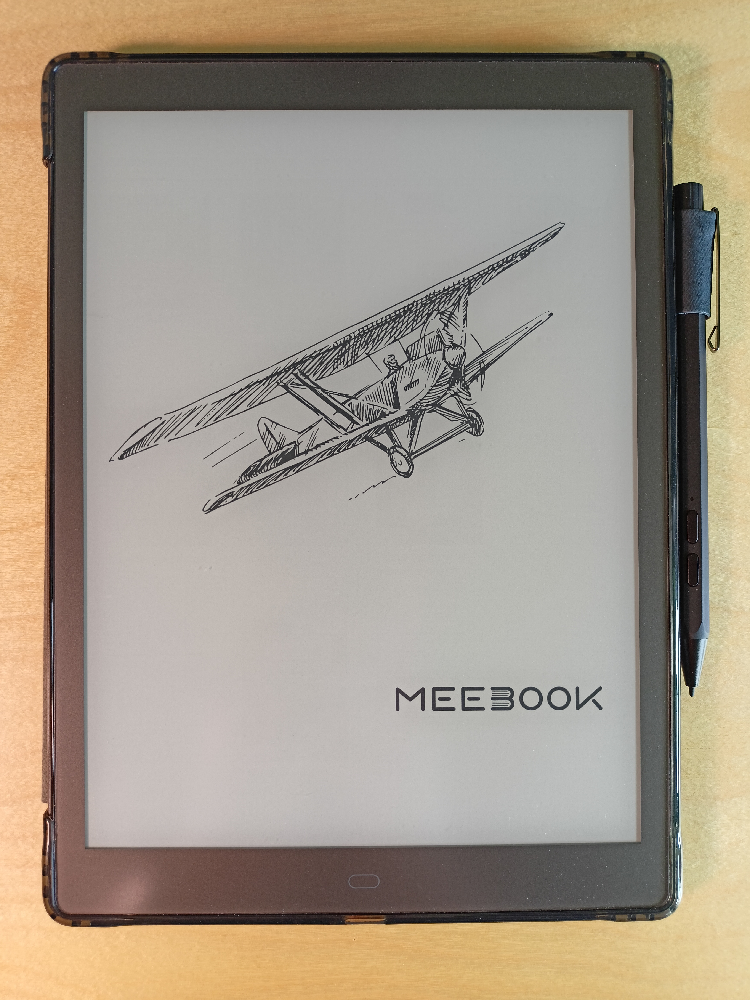
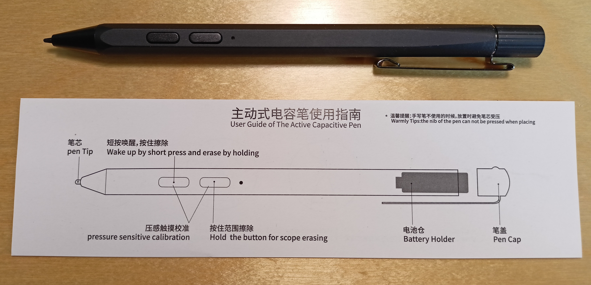
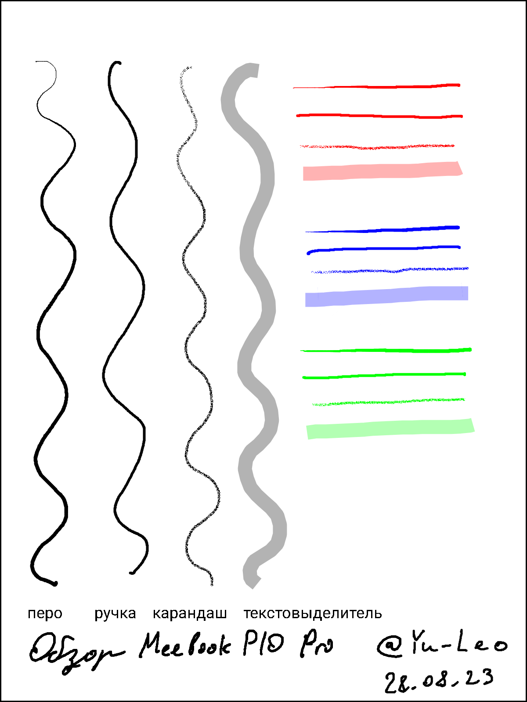

Данная электронная книга была куплена мне в подарок примерно год назад. По прошествии этого времени я сделал её обзор. Но обзор не в виде сухого перечисления технических характеристик, а в виде отзыва, основанного на **личном опыте использования**.

## Зачем и почему?

Когда я заинтересовался чтением технической литературы по программированию, передо мной встал выбор: читать книги в бумажном или же в электронном виде. Второй вариант, в свою очередь, тоже имеет несколько вариантов: читать с экрана ноутбука/монитора, с планшета, либо же с электронной книги. Под электронной книгой я подразумеваю устройство с E-ink дисплеем. Принцип его работы, а так же плюсы и минусы таких дисплеев понятными словами описаны в [этой статье](https://habr.com/ru/articles/437544/).

Некоторое время я пробовал читать с экрана монитора и с планшета, но это оказалось неудобно, поскольку глаза быстро уставали. Так что единственным оставшимся вариантом была книга с электронными чернилами.

Итак, бумажная книга или электронная? Оба варианта имеют как плюсы, так и минусы. 

### Стоимость

Фактор, который в тот момент стал для меня решающим в пользу покупки электронной книги.

БОльшая часть технической литературы в **бумажном** виде стоит **от 1000 руб**., а стоимость некоторых книг доходит **до 5000 руб.** Однако зачастую ту же самую книгу в виде **pdf файла** можно найти на просторах интернета абсолютно **бесплатно**. Нетрудно посчитать, что таким образом электронная книга, стоящая, например, 30 000 руб. "окупится" за прочтение 10-20 книг.

P.S. Я не рассматриваю "окупаемость" бумажной/электронной книги за счёт повышения Вашей заработной платы, являющегося следствием совершенствования Вас как специалиста, (чему в т. ч. могло поспособствовать прочтение книги), поскольку в этом случае всё индивидуально и зависит от *множества* факторов.

### Доступность

Помимо того, что некоторые бумажные книги стоят довольно дорого, их не всегда можно найти в продаже.

Как пример - книга Кэла Ньюпорта "*В работу с головой. Паттерны успеха от IT-специалиста*". Я не нашёл её в продаже ни в одном из известных мне книжных магазинов, работающих в Москве, но при этом с лёгкостью нашёл в виде pdf файла.

Безусловно, в электронном виде так же можно найти далеко не все книги. По моему опыту, техническую литературу было достать проще, чем художественную.

### Масса и габариты

Зачастую электронная книга будет компактнее (как минимум - по толщине) и легче, нежели чем бумажная. Если вы читаете исключительно дома, для вас это, скорее всего, будет не столь значимым фактором. Однако если вы часто перемещаетесь и хотите всегда иметь книгу под рукой, вопрос удобства переноски будет более актуален.

### Выбор модели

Некоторое время я пытался использовать 6-ти дюймовую электронную книгу, которая у меня уже была в доступе, однако её небольшой экран оказался неудобным для моих целей. Исходя из этого, основными критериями выбора новой модели стали наличие большого (10-ти дюймового экрана и возможность открывать pdf-файлы. Помимо того крайне желательным для меня было наличие подсветки экрана.

Под эти требования идеально подходила [PocketBook InkPad X](https://pocketbook.ru/shop/ustroystva/pocketbook-inkpad-x-seryy/), однако цена в **39 999 руб.** была для меня слишком высокой. В процессе поиска аналогов мне попалась менее популярная модель **[Meebook P10 PRO](https://aliexpress.ru/item/1005004311083039.html?sku_id=12000028710228065)**, стоившая на AliExpress примерно **22 000 руб.** за версию без стилуса и **24 000 руб.** за версию со стилусом. После непродолжительных раздумий была выбрана последняя, и, забегая наперёд, это оказалось верным решением. На момент написания статьи (27.08.23) данная электронная книга стоит уже около **32 000 руб.** и **34 000 руб.** за обе версии соответственно.

## Комплектация

В комплекте, помимо самого устройства и зарядного кабеля USB Type-A на USB Type-C, идёт хороший защитный чехол. Его задняя часть выполнена из затемнённого жёсткого силикона с противоударными рёбрами по углам, а передняя - из картона, обшитого приятной на ощупь материей тёмно-синего цвета. Сбоку удобно расположилось крепление для стилуса.

Если вы заказывали версию со стилусом, в комплекте так же будет сам стилус, батарейка, сменные наконечники, а так же инструмент для их замены.

Упаковано всё очень хорошо, коробка выполнена из плотного картона и выглядят презентабельно - может быть важно, если вы рассматриваете данное устройство в качестве подарка.

## Внешний вид

Meebook P10 Pro имеет внешние габариты **174 х 239 x 8.5 мм.**, в которые вписан **10″** экран с размерами **151 x 202 мм.**

На лицевой стороне под тонкой защитной плёнкой располагается сам экран и единственная сенсорная кнопка "домой" под ним.

Рамки вокруг экрана, на первый взгляд, кажутся толстыми. На практике они оказываются практически незаметными и в то же время удобными для того, чтобы держать устройство как одной рукой. Если бы их не было, приходилось бы прижимать большим пальцем сам экран, что провоцировало бы ложные срабатывания.

На нижней грани устройства располагаются разъём **USB Type-C** (для зарядки и передачи данных), индикатор зарядки, динамик и микрофон.

На верхней грани - физическая кнопка питания. 

На задней стороне расположена пластиковая накладка с диагональными бороздками для надёжного хвата книги.

Слот под SD или micro-SD карту **отсутствует**. Однако **есть поддержка OTG** и, как следствие, вы можете использовать внешние носители информации при подключении их через USB Type-C порт.

Масса устройства - **458 г.** (**640 г.** в чехле и со стилусом) Это много. При длительном чтении "на весу" руки начинают уставать, да и рюкзак оно заметно утяжеляет. Но, с другой стороны, за счёт качественной сборки и большой массы устройство ощущается *очень* надёжным (особенно - в чехле).

## Стилус

Свои прямые функции выполняет отлично.

Его корпус выполнен из алюминия, на который нанесено черное покрытие, вызывающее, лично у меня весьма неприятные ощущения (особенно, когда задеваешь его ногтем).

Развесовка стилуса мне так же не понравилась. Батарейка, составляющая основную долю его массы, расположена в задней части; центр масс смещён назад, вследствие чего стилус частенько норовит выпасть из руки. Кстати, **батарейка** здесь формата **АААА** на 1.5v. Та, что шла в комплекте, у меня за год использования не разрядилась.

Я использую его в основном для выделения информации в тексте, чаще всего просто подчеркиваю понравившиеся мысли или выражения. Предустановленный софт позволяет также вести полноценные рукописные заметки, но этот сценарий работы мне не близок.

По скорости и точности работы нареканий у меня не возникло. Обработка и отрисовка линии происходит с минимальной задержкой.

На корпусе стилуса расположено две кнопки. Кратковременное нажатие ближней к наконечнику "пробуждает" стилус, удержание активирует ластик, удаляющий нарисованные линии целиком при их пересечении. Удержание другой кнопки активирует ластик в классическом режиме стирания (очищается только пространство под кончиком стилуса).

Меню параметров рисования включает в себя следующие настройки:
- Инструмент:
	- Перо (толщина линии зависит от силы прижима).
	- Ручка (линия фиксированной толщины).
	- Карандаш ("заполненность" линии зависит от силы прижима).
	- Текстовыделитель (широкая полупрозрачная линия фиксированной ширины).
- Цвет: черный, красный, синий, зелёный либо белый. Экран устройства черно-белый, поэтому все цвета будут на нём лишь оттенками серого, но если экспортировать заметку, а затем открыть её на устройстве с цветным экраном, все цвета будут корректно отображаться.
- Толщина линии.

Пример заметки, созданной на Meebook P10 Pro и экспортированной в виде **.png** файла:

При рисовании линий "пером" и "карандашом" я постепенно увеличивал нажим стилуса на экран, вследствие чего внешний вид линии менялся. Толщину ручки и текстовыделителя можно сделать как меньше, так и больше.

P.S. Внешняя рамка была добавлена мною после экспорта для разделения содержимого заметки и фона сайта.

## Время автономной работы

Больше всего заряда "съедает" подсветка экрана. Но, по моему опыту, даже при её использовании установленного аккумулятора ёмкостью **3900mAh** хватает на несколько недель (с выключенными Wi-Fi и Bluetooth). Не замерял, сколько точно времени требуется для его полной разрядки, поскольку всё зависит от конкретных сценариев использования.

## Экран

В этой электронной книге установлен **10″ сенсорный** черно-белый e-ink экран с плотностью пикселей **200PPI** и разрешением **1200x1600**. По моему мнению, экран хорошего качества. Фон не белоснежный, как писчая бумага, но и далеко не жёлтый, как газетная. Никакого дискомфорта при чтении не вызывает.

При изменении изображения на экране остаются почти невидимые следы от предыдущего кадра. Это является особенностью экранов с электронными чернилами. Если Вам мешают эти следы, Вы можете принудительно очистить экран при помощи кнопки на панели управления. В предустановленном приложении для просмотра файлов можно также настроить частоту полного обновления экрана (например, экран может полностью очищаться на каждое 1-е, 5-е, 10-е и т. д. перелистывание страницы).

### Подсветка экрана

На мой взгляд, очень важная для электронной книги функция. Здесь она **присутствует**. Можно настроить яркость и температуру свечения. Так же доступны 3 стандартных пресета: "День", "Ночь" и "Постель". На мой взгляд они довольно бестолковые, да и вообще мало чем отличаются друг от друга, поэтому я задаю желаемые настройки вручную, в зависимости от окружающего освещения. Меню настройки состоит из двух "ползунков": один отвечает за яркость, другой - за температуру подсветки.

Небольшой минус - подсветка иногда подвисает. Один из сценариев, при котором проявляется этот баг:
1. Подсветка включена.
2. Выключаем подсветку.
3. Выключаем эл. книгу (переводим в спящий режим)
4. Включаем эл. книгу
5. Подсветка считается выключенной в меню, но по факту включена.

Чтобы фактически отключить подсветку, после "пробуждения" эл. книги необходимо выбрать один из пресетов в меню, после чего повторно выключить подсветку.

## Технические характеристики

- **Объём внутреннего накопителя:** 64 GB
- **Объём оперативной памяти:** 3 GB
- **Поддерживает:** 2.4G/5G Wi-Fi, Bluetooth 5.0
- **Процессор:** Четырёхъядерный, 1.8 ГГц

## Программное обеспечение

Работает данное устройство на **Android 11** с фирменной оболочкой **MeeOS**. Есть несколько предустановленных стандартных приложений, а так же Play Market, из которого можно скачать все недостающие. На практике наиболее часто используемое мною приложение - "Книги" - предустановленное приложение для чтения книг и просмотра файлов.

По субъективным ощущениям, всё работает быстро, не тормозит.

Несмотря на то что "под капотом" стоит Android, система вовсе не ощущается перегруженной. Благодаря фирменной оболочке все интерфейсы можно сделать минималистичными.

Чтобы закачать файлы на электронную книгу, её необходимо подключить к компьютеру, после чего в системе она будет отображаться как обычный внешний диск. Перенесённые в папку "Books" файлы будут отображаться в приложении "Книги" на устройстве. Помимо этого, как уверяет производитель, файлы можно также загружать по Wi-Fi или Bluetooth.

Присутствует режим сна, в который устройство переходит по однократному нажатию кнопки питания либо же при закрытии чехла. Можно настроить временные интервалы, в течение которых при отсутствии действий со стороны пользователя книга будет "засыпать" и полностью выключаться. Изображения, которые будут отображаться на экране в этих режимах, при желании можно поменять.

### Перевод на русский язык

Перевод нормальный. Да, местами есть ошибки как перевода, так и UI, а некоторые фразы/слова почему-то в принципе не переведены с английского на русский. Мне кажется это несущественным минусом, поскольку на электронной книге я всё-таки 99% времени просматриваю контент, а не лазаю по меню и настройкам.

### Настройки

Во-первых, их здесь много. Как системных, так и в предустановленных приложениях. Для меня это, конечно, является плюсом, поскольку я хочу настроить всё именно так, как будет удобно лично мне, а не какому-то "среднестатистическому пользователю" или UI/UX-дизайнеру из команды разработки.

Во-вторых, меню системных настроек несколько запутано - это минус. Однако, это не сильно мешает, поскольку бОльшую часть параметров достаточно задать один раз при первичной настройке устройства.

### Приложение "Книги"

Предустановленное приложение для чтения книг и просмотра файлов.

Поддерживает все популярные форматы файлов: TXT, PDF, DJVU, FB2, HTML, RTF, HTXT, EPUB, PDB, DOC, DOCX, PRC, CHM, ASW, PRC, CBR, CBZ, MOBI.

Имеет **огромное** множество как визуальных, так и функциональных настроек. Некоторые из них:

**Визуальные:** 

- Общие:
	- Контрастность
	- Ориентация экрана
	- "Двойная страница": на одном экране будет отображаться по 2 страницы (книжный разворот)
	- Отображение строки состояния системы
	- Отображение панели информации
	- Отображение номера страницы
- Для PDF и проч.:
	- Кадрирование (автоматическое или ручное)
- Для текстовых форматов (FB2 и проч.):
	- Шрифт
	- Размер текста
	- Отступы между строк
	- Отступы между абзацами
	- Внешние отступы между контентом и краями экрана

**Функциональные возможности:** 

- Можно выбрать области экрана, при нажатии в которых будет происходить перелистывание страниц или открытие меню параметров документа.
- Можно оставлять записи прямо в просматриваемом документе при помощи стилуса. Страницы, содержащие такие записи будут сохранены отдельно. При этом можно отключить навигацию при помощи "тапов", чтобы уменьшить ложные срабатывания (в таком случае страницы можно будет переключать только свайпами).
- Можно не только перемещаться по оглавлению документа или по номерам страниц, но и оставлять собственные закладки.
- Можно включить автоматическое перелистывание страниц (скорость настраивается).
- Можно включить автоматическое прочтение текста при помощи Google TSS либо Baidu (у второго доступен только английский и китайский). Настраивается громкость, скорость речи и тайминг. Честно говоря, не особо понимаю, зачем это может быть нужно на практике, поскольку синтезированная речь будет звучать гораздо хуже по сравнению с профессиональной озвучкой книг. Но тем не менее такая опция есть. 

В общем, мне это приложение очень нравится, я использую его как основной инструмент для просмотра файлов. Никаких нареканий по его работе у меня нет.

## Вывод

Несмотря на то что изначально данная электронная книга нужна была мне для чтения технической литературы, впоследствии я стал читать с неё и художественные произведения в метро по дороге на учебу и с учебы, а так же использовать во время выступлений вместо распечаток на бумаге. Для меня это устройство оказалась весьма полезным приобретением.

Покупайте.
