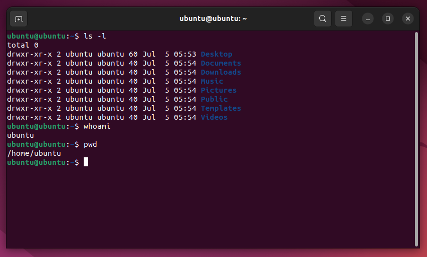
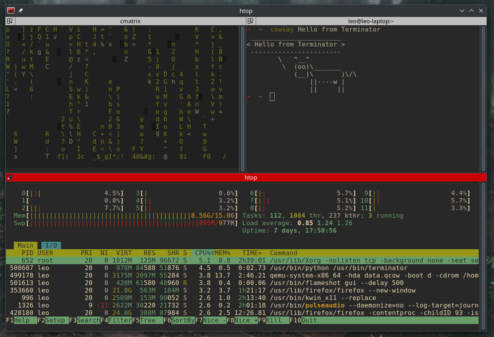
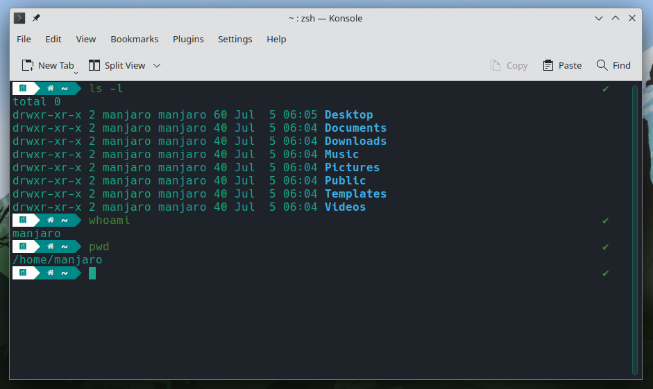
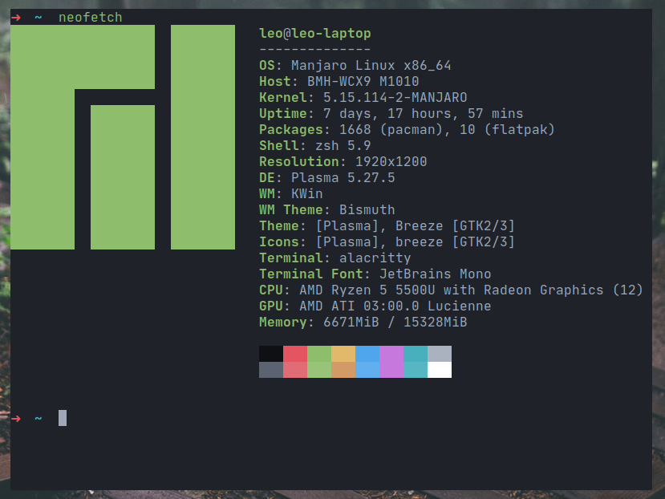
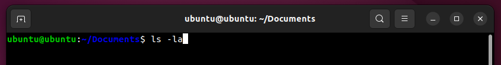
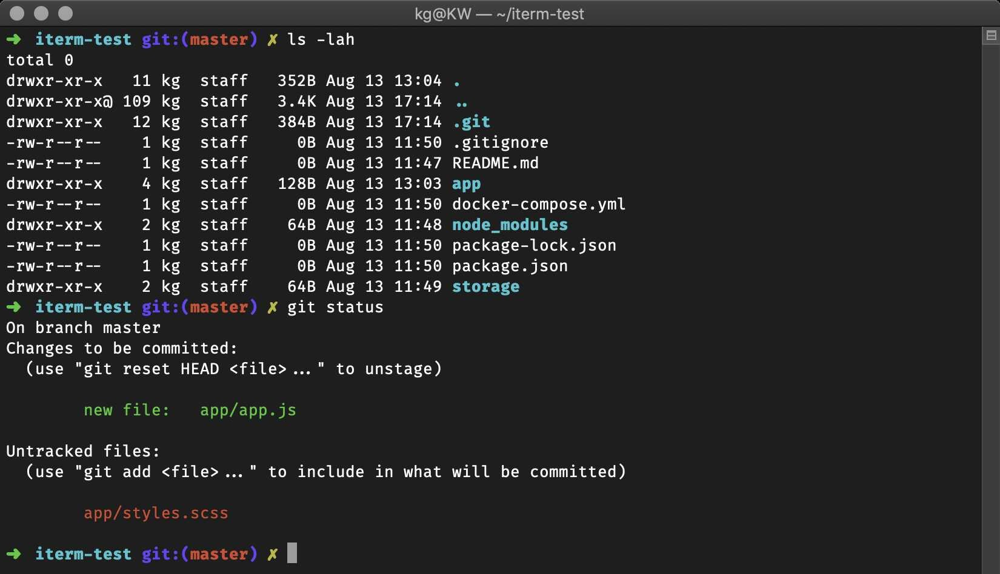
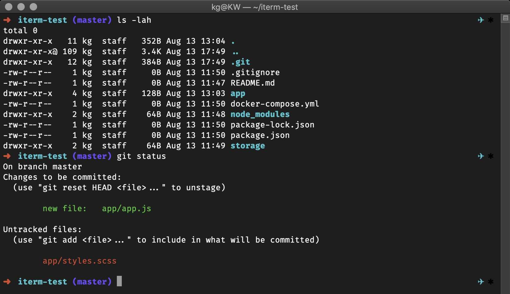
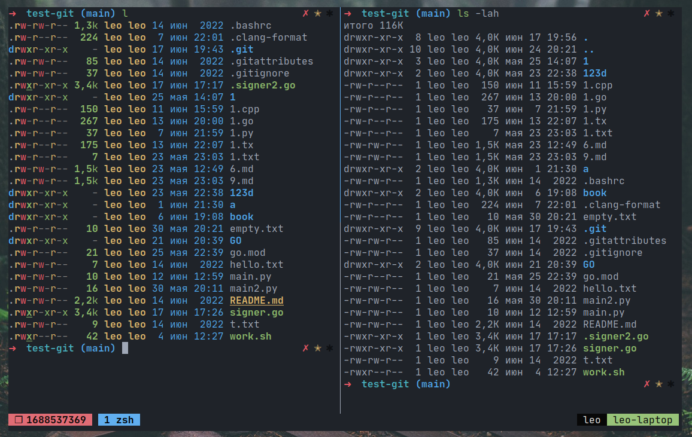
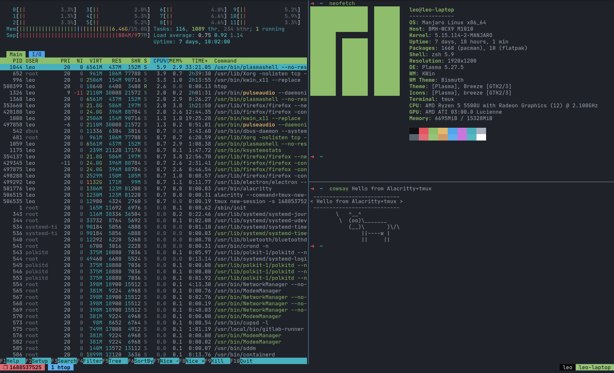
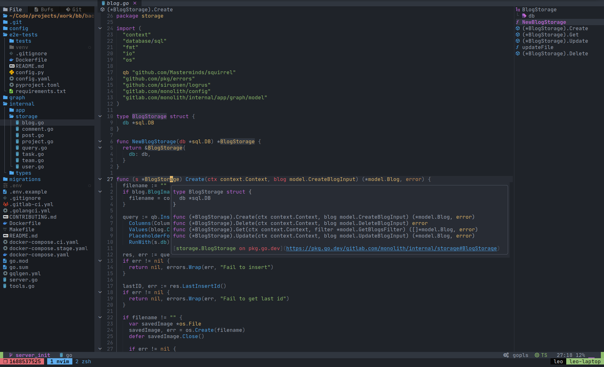

В этой статье я расскажу о том, как я выстроил работу с терминалом в Linux под себя и какие инструменты использовал для этого.

Дистрибутивы на базе ядра Linux я использую в качестве основной ОС последние года два. Начинал с Mint + Cinnamon, работал на Ubuntu, Manjaro + Gnome, Manjaro + Cinnamon, но в итоге на данный момент пришёл к **Manjaro Linux** с окружением рабочего стола **KDE**. Данное сочетание имеет достаточно широкие возможности для кастомизации и при этом вполне приятный графический интерфейс "из коробки". Я считаю его одним из лучших решений как для начинающих, так и для тех, кто просто не хочет заниматься длительной настройкой всей системы под себя.

## Эмулятор терминала

**Эмулятор терминала** — это инструмент, который дает доступ к командной оболочке операционной системы. То, с чего начинается ваше взаимодействие с терминалом, если вы используете ОС с графической оболочкой.

Краткий обзор эмуляторов терминала, которые я использовал:

### Дефолтный Gnome Terminal в Ubuntu

Тема, используемая в Ubuntu по умолчанию, на мой взгляд, ужасна. Я не понимаю, как в принципе можно пользоваться темой с белыми (и тем более - тёмно-синими) буквами  на тёмно-фиолетовом фоне. Очевидно, тему можно поменять; я говорю именно про дефолтную. По функциональности - вполне обычный эмулятор терминала.



### Terminator

Позволяет расположить несколько терминалов в сетке, а так же работать несколькими с вкладками при помощи горячих клавиш. В целом - хороший вариант, сам длительное время пользовался им. Из минусов - раздражающий tilebar у каждого терминала и обилие настроек, управление которыми происходит из графического интерфейса.



### Дефолтный Konsole в Manjaro KDE

Для новичков - очень неплохой вариант. В сборке Manjaro KDE по умолчанию установлен zsh и несколько плагинов (в частности - автодополнение команд и подсветка их синтаксиса)

На мой взгляд, сильно перегружен. Имеет **огромное** количество меню и настроек, управление которыми происходит из графического интерфейса. При должном усилии их можно отключить, но для меня данный инструмент всё равно остаётся антиминималистичным.



### Alacritty

*Мой выбор!* [**Alacritty**](https://github.com/alacritty/alacritty) - очень быстрый, стабильный и **минималистичный** эмулятор терминала. Все его настройки задаются в одном простом конфигурационном файле `~/.config/alacritty/alacritty.yml`.

Некоторые из настроек:
- Темы. Можно прописать каждый цвет палитры вручную, а можно установить тему из [репозитория](https://github.com/alacritty/alacritty-theme) парой команд
- Шрифт, размер текста
- Отступы от краёв окна
- Прозрачность фона
- Дополнительные биндинги клавиш

Мой конфигурационный файл - [тут](https://github.com/Yu-Leo/knowledge-base/blob/main/configs/alacritty-config/alacritty.yml).

В терминале я обычно использую тему [onedark (darker)](https://github.com/navarasu/onedark.nvim), поэтому прописал в конфиге все цвета вручную.

Минусы:
- Не очень подробная и понятная [документация](https://github.com/alacritty/alacritty/wiki). Однако, если уметь искать информацию, любой вопрос можно решить.
- Отсутствие вкладок и окон. Этот недостаток я решил при помощи терминального мультиплексора `tmux`.
- Отсутствие возможности настроить размытие заднего фона при включении прозрачности терминала, в отличие от того же Konsole. Для меня этот недостаток не является критичным, поскольку 99% времени прозрачность терминала у меня выключена.
- Отсутствие поддержки [sixel](https://en.wikipedia.org/wiki/Sixel). Для меня это также не является критичным, но если вам она необходима, существует [сборка Alacritty с поддержкой sixel](https://github.com/microo8/alacritty-sixel).



Для того чтобы всегда иметь терминал "под рукой", я забиндил запуск Alacritty на сочетание клавиш `Meta` (`Win`) + `Enter`.

## Командная оболочка

### bash

Используется в большинстве дистрибутивов по умолчанию.

Обычно приглашение ко вводу имеет следующий вид: `username@hostname:current-directory$`



Его можно настроить в переменной `$PS1`, однако можно столкнуться со [сломавшейся историей команд](https://www.linux.org.ru/forum/desktop/16257831). 

Новичкам и тем, кто редко работает с терминалом, подойдёт, но для частого и профессионального использования лучше присмотреться к более продвинутым аналогам.

### zsh

*Мой выбор!* Гораздо более кастомизируемая и функциональная, по сравнению с bash, оболочка. Особенно при использовании фреймворка [oh-my-zsh](https://ohmyz.sh/).

Мой конфигурационный файл - [тут](https://github.com/Yu-Leo/knowledge-base/blob/main/configs/zsh-config/.zshrc).

Установить в качестве оболочки по умолчанию:
```shell
chsh -s /bin/zsh
```

#### Темы

Расширение oh-my-zsh позволяет выбрать одну из [готовых тем](https://github.com/ohmyzsh/ohmyzsh/wiki/Themes) или создать свою. Под темой подразумеваются настройки приглашения ко вводу.

По умолчанию используется тема `robbyrussell`:



Я предпочитаю `gozilla`, поскольку она более минималистичная.



#### Плагины

Расширение oh-my-zsh позволяет добавлять [множество плагинов](https://github.com/ohmyzsh/ohmyzsh/wiki/Plugins), которые упрощают и ускоряют работу с терминалом. Список подключаемых плагинов задаётся в следующей строчке в файле конфигурации (`~/.zshrc`):
```bash
plugins=(...) # Названия плагинов перечисляются через пробел
```
Я использую:
- **git** - алиасы и функции для работы с git
- **tmux** - алиасы и настройки для работы с tmux
- **history** - 3 алиаса для быстрой работы с историей команд
- **sudo** - двойное нажатие `esc` добавляет `sudo ` в начало набранной команды
- **zsh-syntax-highlighting** - подсветка синтаксиса команд. [Устанавливается отдельно](https://github.com/zsh-users/zsh-syntax-highlighting/blob/master/INSTALL.md#oh-my-zsh)

#### Кастомные алиасы

Помимо алиасов, предоставляемых oh-my-zsh и плагинами, я задал собственные алиасы: 
```bash
alias i="sudo pacman -S"
alias m="make"
alias n="nvim"
alias v="vim"
alias c="clear"
```
Вместо стандартной команды ls использую её современный аналог [exa](https://the.exa.website/).
```bash
if [ -x "$(command -v exa)" ]; then
    alias l="exa --long --all --group"
fi
```

Разница в выводах данных команд видна на скриншоте:



"Шаблонный" алиас для ускорения открытия рабочего проекта:
```bash
alias gptd="cd <path-to-dir> && nvim"
```
Мнемоническое правило:
- `g` - go (идти, перейти)
- `ptd` - одна или несколько букв, обозначающих рабочую директорию

Посмотреть все заданные алиасы можно при помощи команды `alias`.

## Лайфхаки

### Перемещение по директориям

- `pushd <path-to-dir>` - перейти в директорию
- `popd` - вернуться

### Горячие клавиши

- `Ctrl + u` - в **bash** - вырезать всё от курсора до начала строки (команды), в **zsh** - вырезать строку (команду) целиком ([можно переопределить поведение](https://stackoverflow.com/questions/3483604/which-shortcut-in-zsh-does-the-same-as-ctrl-u-in-bash))
- `Ctrl + y` - вставить вырезанную команду
- `Ctrl + a/e` - перейти в начало/конец строки
- `Ctrl + d` - удалить символ под курсором
- `Ctrl + f/b` - двигать курсор вправо/влево по символам
- `Alt + f/b` - двигать курсор вправо/влево по словам
- `Ctrl + r` - поиск по истории команд

Больше горячих клавиш - в [статье](https://habr.com/p/99843/).

### Разное 

- `reset` - перезапуск сессии командной строки
- `sudo !!` - повторить предыдущую команду с `sudo`
- `history` - история команд
- `!n` (где `n` - номер команды) - запустить команду из истории
- `!*` - подставить все аргументы предыдущей команды
- `!^`, `!$` - подставить первый/последний аргумент предыдущей команды

## tmux

[**tmux**](https://github.com/tmux/tmux) - утилита-мультиплексор, предоставляющая доступ к нескольким терминалам одновременно.



Возможности:
- Открывать несколько сессий 
- Открывать несколько вкладок в сессии 
- Открывать несколько окон в вкладке
- Сохранять сессии
- Выводить toolbar c открытыми вкладками, а так же другой информацией

Управление происходит преимущественно при помощи горячих клавиш, что позволяет ускорить работу.

Каждое сочетание горячих клавиш в tmux начинается с префикса. По умолчанию это сочетание клавиш `Ctrl+b`. Однако для удобства я изменил его на `Ctrl+a` и переназначил в системе редкоиспользуемую мною клавишу `Caps Lock` на `Ctrl`. Таким образом, управление tmux ускоряется ещё сильнее.

Моя конфигурация и её описание - [тут](https://github.com/Yu-Leo/knowledge-base/tree/main/configs/tmux-config).

### Сценарии использования

**При работе на локальной машине.** Как я писал выше, Alacritty не поддерживает работу с несколькими вкладками и окнами. Что ж, не беда, - tmux прекрасно справляется с этой задачей! Он позволяет управлять множеством окон терминалов даже гибче и быстрее, чем иные эмуляторы терминала, поддерживающие работу с несколькими вкладками и окнами.

**При работе на сервере.** При подключении к удалённому серверу по ssh крайне удобно сразу запустить на нём tmux-сессию, которая позволит открыть несколько окон с терминалами и работать в них параллельно. Помимо этого преимущества использование tmux даёт как минимум ещё одно. При отключении от сервера (намеренном или случайном) сессия tmux по-прежнему остаётся запущенной, а значит все открытые вкладки и окна при последующем подключении останутся в том состоянии, в котором они находились на момент отключения.

### Быстрый запуск

Согласитесь, каждый раз запускать эмулятор терминала (пусть даже при помощи горячей клавиши), затем создавать новую сессию tmux (путь даже при помощи алиаса), а после окончания работы не забывать её удалить - сложно и долго. Нельзя ли это как-то автоматизировать? Мы же в Linux - конечно, можно!

Я написал пару простых bash-скриптов, которые позволяют запускать Alacritty, создавать новую tmux-сессию, имеющую уникальное имя (количество секунд, прошедших с 00:00 01.01.1970), и после закрытия автоматически удалять созданную сессию.

**alacritty-with-tmux.sh**
```bash
#!/bin/sh
cur_time=$(date +%s)
alacritty --command=tmux-new-session.sh && tmux kill-session -t $cur_time 
```
**tmux-new-session.sh**
```bash
#!/bin/sh
tmux new-session -s $(date +%s)
exit $?
```

Остаётся только дать этим скриптам права на запуск, положить их в `~/.local/bin/` и в настройках окружения рабочего стола забиндить какую-либо горячую клавишу (в моём случае - `Meta`+`Ctrl`+`Enter`) на запуск скрипта `alacritty-with-tmux.sh`. Всё! Теперь вы можете запускать Alacritty сразу с tmux'ом всего одной горячей клавишей.

## nvim

Про [vim](https://github.com/vim/vim) можно говорить бесконечно ~~(как и шутить про выход из него)~~. Сейчас я расскажу лишь малую часть, а более подробный обзор возможностей vim и моей конфигурации выйдет в отдельной статье.

Я использую форк vim'а - [neovim](https://github.com/neovim/neovim) (nvim). Одно из наиболее важных его преимуществ - удобство настройки и кастомизации. Все параметры, подключение плагинов и даже собственные плагины можно описать при помощи lua, в отличие от оригинального vim, в котором используется собственный язык - VimScript.

### Для разработки

"Из коробки" neovim проигрывает по функциональности современным IDE в ряде аспектов. Суть использования подобных инструментов отчасти заключается в том, что каждый пользователь может и должен сам понять, какая функциональность ему необходима, и добавить её в свою конфигурацию при помощи задания собственных параметров в настройках и подключения плагинов.

Если вы ещё не определились, какая именно функциональность вам нужна, а попробовать использовать neovim для работы над полноценными проектами хочется, рекомендую начать с популярной сборки [AstroNvim](https://astronvim.com/), имеющей в своём составе множество плагинов, превращающих данный текстовый редактор в полноценную IDE.

Я нахожу крайне удобной связку tmux+nvim. Один из моих сценариев её использования: в одной вкладке tmux'а открыт nvim с кодом проекта, в другой - запускается сервер, в третьей - тесты, и т. д.



## Вывод

Некоторые считают, что использование терминала - устаревший способ взаимодействия с компьютером и гораздо проще делать всё из приложений с графическим интерфейсом при помощи манипулятора типа "мышь". На мой взгляд, это не так. Множество действий можно гораздо быстрее выполнять при помощи терминала. Безусловно, понадобится некоторое время, чтобы запомнить все необходимые хоткеи, наработать мышечную память, и, что немаловажно - понять именно свои потребности, после чего подобрать и настроить каждый инструмент под себя. Однако после этого вы получите колоссальный прирост производительности при меньших трудозатратах.

[Статья на Habr](https://habr.com/p/746730/).

## Материалы

- ["Top 10 Oh My Zsh Plugins For Productive Developers"](https://youtu.be/LEOqiyxx16c)
- ["The top 5 zsh plugins I can't live without!"](https://youtu.be/wHnMd8uz6j0)
- [Плейлист про tmux на канале "Диджитализируй!"](https://www.youtube.com/playlist?list=PLAk6CfuV7hyq4NeNn8gJt8OEpPisPh_Fr)
- ["Красивый терминал за 5 минут"](https://youtu.be/yfq1H9bT8c4)
- ["Настройка терминала в macOS, установка Alacritty, Kitty и консольных утилит"](https://youtu.be/RCbhcGbUrm4)
- ["Vim 06 - Vim + Tmux = ♥"](https://youtu.be/hXAEUUsvMA0)
- ["Терминал, командная строка, ZSH, BASH, FISH, Alacritty, Kitty, Foot, URXVT, st"](https://youtu.be/2d-PMO6HrKU)
