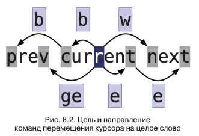

<hr>

- Название: **"Практическое использование Vim" (2-е издание)**
- Автор: **Дрю Нейл**
- Начало чтения: **28.05.25**
- Конец чтения: **16.06.25**
- Оценка: **5/5**

<hr>

## Введение

- **Откуда узнал про книгу:** искал книги по vim, нашёл в Яндексе
- **Цель на проработку книги:** сделать моё взаимодействие с vim более эффективным
- **Глобальная цель:** эффективно использовать профессиональные инструменты для выполнения рабочих задач
- **Задачи:**
	1. Изучить базовые возможности vim, которые я ещё не знаю
	2. Внедрить их в свою работу и закрепить, если они будут эффективны и полезны для меня
	3. Лучше понять философию, историю появления и развития vi и vim
	4. Получить представление о расширенных возможностях vim, которые могут быть полезны для решения узкоспециализированных задач

## Рецензия

Отличная книга о Vim!

Читал после ["Изучаем vi и Vim. Не просто редакторы"](https://yu-leo.github.io/yu0dev/posts/learning-the-vi-and-vim-editors/). Обе книги отлично дополняют друг друга. Первая - более фундаментальная и теоретическая, вторая - более практико-ориентированная. Рекомендую к прочтению обе всем интересующимся Vim.

По структуре книга - сборник рецептов. Я читал по порядку, но можно было и выборочно. Принцип "от простого к сложному" соблюдается только в рамках глав, но не всей книги.

**Что понравилось:** практико-ориентированный подход. Структура в виде рецептов для решения конкретных задач

**Наиболее полезным для меня было:**
1. Команды с `g`
2. Описание возможностей поиска и замены
3. Описание возможностей макросов

**Что не понравилось:**
1. Местами странное разбиение на рецепты. То слишком большие, то слишком маленькие
2. Не хватило более узкоспециализированных рецептов. Лайфхаков, фишечек. В т ч по настройке конфига

## Конспект

> Поставьте перед собой цель достичь такого уровня владения редактором Vim, когда вы не будете задумываться о своих действиях. Добившись этого, вы сможете править текст со скоростью мысли.

> В руках мастера Vim кромсает текст со скоростью мысли.

*Хочу дойти до уровня использования Vim, когда скорость редактирования текста будет по-настоящему впечатляющей*

### Глава 1. Путь Vim

`>{motion}` - увеличить отступ по `{motion}`. `>G` - до конца файла. 

*Не задумывался, но ведь действительно. Использовал только `>>` - над текущей строкой. Нужно больше использовать c `{motion}`*

На протяжении всей книги автор красной нитью проводит важность команды "точка". Идеальная формула точки: "одно нажатие для перехода и одно - для изменения". *Я пока не осознал её мощь; использовать чаще*

- `@:` - повтор команды `Ex`
- `&` - повтор подстановки (`:s/old/new`)

### Глава 2. Командный режим

Про командный режим интересная аналогия с художником и холстом.

Как часто покидать режим вставки? "Блоки отмены" должны соответствовать одной законченной мысли. Новая строка - не `<CR>` в режиме вставки, а `<Esc>o`.

Перемещения в режиме вставки закрывают блок отмены.

> Лучше 6 раз нажать точку, чем высчитывать, сколько именно повторов нужно. Не переусердствовать с счетчиками.

`gUgU` или `gUU` - текущую строку в верхний регистр

### Глава 3. Режим вставки

Мапинги в insert-mode:
- `<C-h>` - удалить символ слева от курсора
- `<C-w>` - удалить слово слева от курсора
- `<C-u>` - удалить строку слева от курсора
-  `<C-o>`- командный подрежим режима вставки. *Особо не использую, мб полезно*

`<C-r>=3*3<CR>` - работа с регистром выражений как с калькулятором. Вставит результат. *Интересная возможность, мб полезно*

### Глава 4. Визуальный режим

- `gv` - выделить последнее визуальное выделение
- `o` - переместить курсор в другой конец выделенного фрагмента

Из построчного и блочного визуального режимов можно переключаться в посимвольный нажатием `v`

Есть проблемы с использованием точки в визуальном режиме. Поэтому лучше использовать операторы командного режима вместо визуального режима. Вообще если нужно повторять операции, то командный режим лучше визуального

> Со строками текста можно работать в любом редакторе, но для выполнения операциями над колонками текста требуется более специализированный инструмент. Vim поддерживает такую возможность

*Ведь и правда! Вообще не очевидный момент для большинства редакторов, а в Vim есть из коробки и достаточно понятно*

- `Vr-` - заметить выделенный фрагмент на символы. *Необычно, надо использовать*

В блочном режиме блоки мб непрямоугольные. Можно выделять до концов строк через `$` по самой длинной строке

В блочном визуальном режиме лучше юзать `I`/`A` вместо `i`/`a`

### Глава 5. Режим командной строки

Работают в режиме командной строки:
- `<C-h>` - удалить символ слева от курсора
- `<C-w>` - удалить слово слева от курсора
- `<C-u>` - удалить строку слева от курсора

`:[range]normal{commands}` - применение команд нормального режима к диапазону строк. Например, точки

- `:%normal A;` - добавить `;` в конец каждой строки

Перед выполнением команды перемещает курсор в начало строки

- `:%normal i//` - закомментить все строки в файле

`<C-r><C-w>` в режиме командной строки - вставить слово под курсором в командную строку

`:read !cmd` - вывести stdout внешней cmd в текущий буфер
`:write !cmd` - передать в stdin внешней cmd текущий буфер

Про сценарии:
1. Пишем сценарий в `somename.vim`
2. Открываем буфер, в командной строке вызываем `:source somename.vim`
3. Если открыто несколько файлов, можно применить ко всем: `:argdo source somename.vim`

### Глава 6. Управление несколькими файлами

- `:e` - считать содержимое файла в буфер. Затрет несохранённые изменения
- `:sp {file}` / `:vsp {file}` - сразу открыть файл в сплите
- `:only` - закрыть все окна кроме текущего

*Нужно подумать, как оптимизировать работу с сплитами и использовать их чаще.*

Хорошая аналогия:

> Вкладки Vim больше напоминают виртуальные рабочие столы, чем привычные вкладки в других текстовых редакторах

### Глава 7. Открытие файлов и сохранение их на диск

`:pwd` - вывод текущей директории

netrw - стандартный обозреватель файлов в Vim. В Neovim его нет

`vim .` или `:E`/`:Explore`

Создать новый файл с несуществующими директориями в названии

```
:edit some/dir/new.txt
:write -- Ошибка
:!mkdir -p %:h
:write
```

Кейс: открыли файл, для редактирования которого нужны права супер-юзера. Можно всё равно сохранить этот файл, не выходя из vim:

`:w !sudo tee % > /dev/null`

Потом нажимаем `l`

### Глава 8. Навигация внутри файлов

`go`/`g^`/`g$` - к первому / первому непробельному / последнему символу **экранной** строки



`ea` / `gea` - полезные комбы

Команды поиска можно использовать в операциях

`v` + `/ge<CR>` + `d`

а можно даже

`d` + `/ge`

Метки:
- `m{char}` - поставить метку. Нижний регистр - логально для буфера, верхний - глобально
- \`{mark} - к метке

Автоматические метки:

- \`\` - позиция перед последним переходом в текущем файле
- \`. - место последнего изменения
- \`^ - место последней вставки
- \`\[ / \`\] - начало / конец последнего изменения/скопированного блока
- \`\< / \`\> - начало / конец последнего выделения в визуальном режиме

matchit.vim - для расширения `%` до ключевых слов. *Мб полезно для lua*

### Глава 9. Навигация между файлами

Команды перемещения - внутри файла, команды перехода - между файлами. Некоторые перемещения классифицируются как переходы - перемещения на дальние дистанции (не соседняя строка / слово)

`:jumps` - список переходов

Каждое окно имеет свой собственный список переходов для `<C-o>` и `<C-i>`

`:changes` - история изменений

`g;` и `g,` - перемещения вперёд-назад по истории изменений. *Вот это здорово, не знал*

Вышли из режима вставки, перешли в другое место документа, `gi` вернёт обратно и сразу перейдёт в режим вставки. *Мб, полезно. У меня конфликтует с LSP мапингом, мб поменять.*

Список изменений свой для каждого буфера

Параметр `suffixesadd` - для определения списка расширений, которые vim будет подставлять после имени файла для `gf`

### Глава 10. Копирование и вставка

`gp` и `gP` - аналог `p` / `P` для вставки строк, но курсор будет в конце блока. *Поиспользовать, мб, полезно*

### Глава 11. Макросы

- `q{register}` - старт записи макроса
- `q` - стоп
- `@{register}` - воспроизведение
- `@@` - повторить последний макрос

Макросы на самом деле записываются в регистры. `:reg a` - можно просмотреть содержимое регистра и увидеть запись макроса

Как записать хороший макрос:
1. Нормализовать положение курсора
2. Перемещать курсор повторяемыми командами. Можно использовать команды поиска, текстовые объекты. Нельзя использовать мышь
3. Если команда терпит неудачу (k на первой строке и т.п.), Vim прерывает макрос. `f{char}` - хороший предохранитель

Два варианта выполнения макросов: последовательный и параллельный. Параллельный по факту тоже последовательный, это просто такое название. Отличия в том, что последовательный останавливается, если один макрос зафейлился, параллельный - нет

- `3@a` - последовательный
- выделить вызиальный блок, а потом `:normal @a` - параллельный

Записали макрос в регистр a: `qa` --> `q`
- `qa` ещё раз - перезапись
- `qA` - дозапись в конец регистра

*Интересный момент: как правило, я нормализовывал курсор в конце макроса (переходя к следующему элементу). Но правильнее делать это в начале макроса, чтобы он был более универсальным*

`:argdo normal @a` - выполнить макрос для всех буферов в списке аргументов

В макросы можно записывать команды Ex в т ч (в примере - `:next`)

`:wall` - сохранить все буферы в списке
`:wnext` - сохранить текущий файл и перейти к следующему буферу

Интересный пример: задача пронумеровать строки

```
one
two
three
```

```
1) one
2) two
3) three
```

Как делать:
1. `:let i=0`
2. `qa`
3. `I<C-r>=i<CR>)`
4. `<esc>`
5. `:let i += 1`
6. `q`

Используем переменную-счетчик и регистр выражений для вставки в текст документа

Vim не оптимизирует макросы, не удаляет компенсирующие друг друга действия

`:put a` - вставляет содержимое регистра в новую строку, ниже предыдущей (даже если в регистре не строка)

Как редактировать макросы:
1. Вставить в буфер из регистра: `:put a` или `"ap`
2. Отредактировать
3. Скопировать обратно в регистр: `0` и потом `"ay$`

### Глава 12. Поиск по шаблону и поиск точного совпадения

Параметр `ignorecase` - игнорировать регистр при поиске

- `\c` - игнорировать регистр
- `\C` - не игнорировать регистр

Вводятся в любом месте в поиске `/`

`smartcase` - игнорировать только в нижнем регистре. *Имба*

По умолчанию поиск интерпретирует `.,*?` как спецсимволы. `/\V{выражение}` - отключает эту функциональность. Все символы воспринимаются как обычные

`/\v<the>` - поиск "the" как СЛОВА

Шаблон - текст в командной строке. Совпадение - фактически найденный текст. Шаблон не всегда равен совпадению

`\zs` и `\ze` - задают начало и конец совпадения. То есть можно из выборки селектить не всё, а только часть. *Вот это круто, не хватало!*

Есть функция escape, которая автоматически экранирует, там ещё юзается регистр вычислений. Сложно

### Глава 13. Поиск

- `gn` - в визуальном режиме выделить следующее совпадение, но не перемещать курсор. Можно использовать как текстовый объект. `dgn` / `cgn` и тд
- `/lang/e` - искать совпадения и ставить курсор на последний символ

### Глава 14. Подстановка

`:[range]s[ubtitle]/{pattern}/{string}/[flags]`

**Флаги:**
- `g` - глобально во всей строке
- `c` - запрос подтверждения
- `n` - только подсчет числа совпадений, без подстановки
- `&` - повторно использовать набор флагов предыдущей команды

**Спецсимволы в строке замены:**
- `\r` - возврат каретки
- `\t` - табуляция
- `\\` - один обратный слеш
- `\1`, `\2`, `\0` - совпадение с первым/вторым/.../последним подвыражением в скобках
- `&` - полное совпадение с шаблоном
- `~` - `{string}` из предыдущей команды подстановки
- `\={vim script}` - вычисляет результат `{vim script}`

Если поле шаблона оставить пустым, то будет использован шаблон из последней команды поиска

`:%s/\n/` - объединить все строки файла через запятые. *Интересная вещь, мб нужно поиграться с диапазонами ещё*

Можно вставлять содержимое регистра в `{string}`

Пример:

`:s/target/raplacement/g`

 - `g&` - повторить предыдущую команду замены, но для всего файла
- `:&&` - повторить последнюю команду подстановки. Работает с диапазонами, полезно с визуальным режимом

Задача: переставить поля CSV файла в обратном порядке (три поля)
```
/\v^([^,]*),([^,]*),([^,]*)$
:%s//\3,\2,\1
```

*Как-то задумывался про эту задачу. Удивительно, как просто она решается в Vim.*

Как выполнить замену во всех файлах проекта:
1. Сформировать команды поиска и замены
2. Через `:vimgrep` найти все совпадения по команде поиска
3. `:cfdo {cmd}` - выполнить команду для всех элементов QuickFix List 
4. `:cfdo update` - сохранить все изменения

`:update`- сохраняет файл на диск, но только если он был изменён

### Глава 15. Глобализация команд

`:global` (`:g`) позволяет применить команду Ex для каждой строки, соответствующей шаблону

`:[range] global[!] /{pattern}/[range][cmd]`

По умочанию применяется ко всему буферу

`!` / `:vgloval` (`:v`) - инвертировать (in**V**ert), т.е. применять для строк НЕ удовлетворяющих шаблону

cmd мб пустым, тогда будет просто `print`

- `p` - print
- `d` - delete

`:g/todo/yank A` - выписать все TODO в регистр `a`. Заглавная а - значит "добавить"

`:g/todo/t$` - скопировать в конец буфера

### Глава 17. Quickfix List

- `:cnext` / `:cprev`- следующая / предыдущая записи
- `:copen` / `:cclose` - открыть/закрыть qf
-  `:cdo {cmd}` - применить к каждой строке
- `:cfdo` - применить к каждому файлу
- `:colder` / `:cnewer` - переходы по спискам qf

Можно настроить `:make` и `:compiler` для сборки проекта
