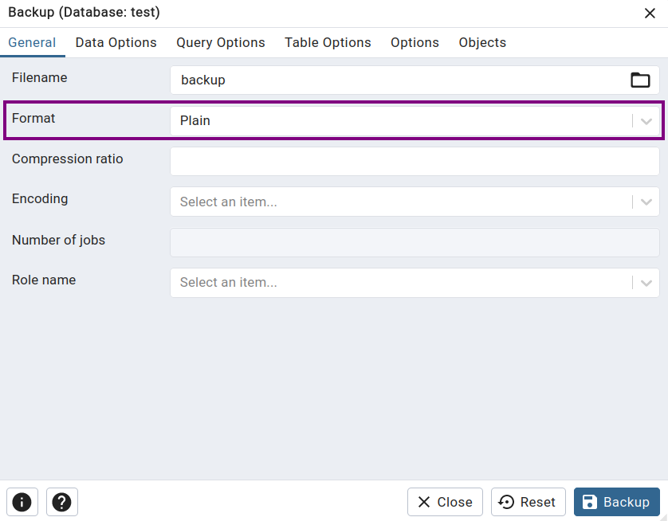

## Постановка задачи
Хочу поднять [PostgreSQL](https://www.postgresql.org/) на локальном компьютере (Manjaro + KDE) для учебных целей и управлять им через [pgAdmin](https://www.pgadmin.org/) и [psql](https://www.postgresql.org/docs/current/app-psql.html) .
## Решение
Мой выбор пал на [**Docker**](https://www.docker.com/), поскольку он позволяет реализовать задуманное с наименьшими затратами времени и минимальным влиянием на остальную систему. *А ещё потому что я не смог быстро поставить pgAdmin напрямую в Manjaro ¯\\_(ツ)_/¯*

В начале [установите Docker](https://docs.docker.com/get-docker/), если он у вас ещё не установлен.

Мы будем поднимать два контейнера: один с [PostgreSQL](https://hub.docker.com/_/postgres), другой — с [pgAdmin](https://hub.docker.com/r/dpage/pgadmin4/). Объединим их при помощи [docker compose](https://docs.docker.com/compose/). Создайте следующий файл в рабочей директории:

```yaml {lineNos=false title="docker-compose.yaml"}
version: "3.8"

services:
  postgres:
    image: postgres:16.3-alpine
    environment:
      POSTGRES_PASSWORD: postgres
      POSTGRES_USER: postgres
    ports:
      - "5432:5432"
    volumes:
      - postgres:/var/lib/postgresql/data

  pgadmin:
    image: dpage/pgadmin4:8.6
    environment:
      PGADMIN_DEFAULT_EMAIL: admin@pgadmin.com
      PGADMIN_DEFAULT_PASSWORD: password
      PGADMIN_LISTEN_PORT: 80
    ports:
      - "15432:80"
    volumes:
      - pgadmin:/var/lib/pgadmin
    depends_on:
      - postgres

volumes:
  postgres:
  pgadmin:
```

*[Источник вдохновения](https://anasdidi.dev/articles/200713-docker-compose-postgres/).*

Я пробрасываю наружу `5432` порт, потому что хочу работать с postgres-ом из хостовой ОС через `psql`.
### Управление контейнерами
Чтобы **запустить** контейнеры в фоне, выполните команду
```shell
docker compose up -d
```
в директории с описанным выше `docker-compose.yaml` файлом.

👉 После того как контейнеры запустятся, на [http://localhost:15432/](http://localhost:15432/) будет доступна веб-версия pgAdmin.

**Данные для входа** прописаны в `docker-compose.yaml`: 
- Логин: `admin@pgadmin.com` — поле`PGADMIN_DEFAULT_EMAIL`
- Пароль: `password` — поле`PGADMIN_DEFAULT_PASSWORD`

При необходимости их можно поменять.

**После первого запуска** нажмите "*Add New Server*", чтобы подключиться к PostgreSQL.
- Host name/address: `postgres` — название контейнера c postgres в `docker-compose.yaml`
- Username:  `postgres` — поле `POSTGRES_USER`
- Password: `postgres` — поле `POSTGRES_PASSWORD`

**Profit** 🎆. Пользуйтесь pgAdmin.

Чтобы **остановить** контейнеры, выполните команду
```shell
docker compose down
```
При этом **данные** и PostgreSQL и pgAdmin **останутся** и будут доступы при следующем запуске контейнера. Они хранятся в [docker volume](https://docs.docker.com/storage/volumes/)-ах, которые мы описали в `docker-compose.yaml`.
### Данные pgAdmin
В pgAdmin можно сохранять файлы: бэкапы, ER диаграммы баз. Проводник в GUI pgAdmin показывает, что они лежат в корне файловой системы. Не верьте ему! На самом деле они лежат в docker volume (*очевидно*), но не в его корне (*уже менее очевидно, но факт*).

**Посмотреть файлы в контейнере:**
1. Заходим в контейнер:
```shell
docker exec -it <containerName> sh
```

2. Внутри docker-контейнера переходим в директорию пользователя
```shell
cd /var/lib/pgadmin/storage/admin_pgadmin.com
```
`admin_pgadmin.com` — email пользователя, в котором `@` заменён на `_`

3. *Вот тут-то они и притаились.* Можно взглянуть на содержимое директории через `ls -lah`, просмотреть файлы при помощи `less` и даже открыть их в `vi`!

**Стянуть файлы из контейнера в хостовую ОС:**
```shell
docker cp <containerId>:/file/path/within/container /host/path/target
```

Имя и Id контейнера можно узнать, взглянув на список запущенных контейнеров командой
```shell
docker ps
```

💡Docker-контейнерами можно управлять при помощи утилиты [lazydocker](https://github.com/jesseduffield/lazydocker).

### Бэкапы в pgAdmin
Для того, чтобы файлы бэкапов имели человекочикаемый вид, их нужно создавать со следующими настройками:


❗ Впоследствии мне **не удалось восстановить** БД в pgAdmin через такой бэкап, в отличие от бэкапа с форматом `Custom` — они создаются по умолчанию.
### psql
Подключиться к контейнеру с postgres-ом можно командой:
```shell
psql -h localhost -p 5432 -U postgres -d dbname
```

`dbname` — имя БД, к которой подключаемся

Данные для входа прописаны в `docker-compose.yaml`: 
- Логин: `postgres` — поле `POSTGRES_USER`
- Пароль: `postgres` — поле `POSTGRES_PASSWORD`

При необходимости их можно поменять.

[Шпаргалка по psql](https://www.oslogic.ru/knowledge/598/shpargalka-po-osnovnym-komandam-postgresql/).
## В заключение

🦁 Порекомендую интересующимся пройти ["Интерактивный тренажер по SQL"](https://stepik.org/course/63054/promo ) на Stepik. Курс содержит теоретическую информацию по SQL и множество практических заданий с автоматической проверкой.
