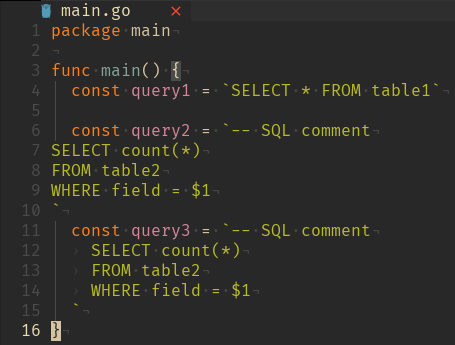
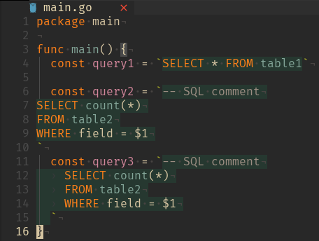

## Постановка задачи

**Задача:** настроить в исходном коде (`Go`/`Python`/`ваш_любимый_язык`) подсветку синтаксиса внутри строковых переменных, содержащих SQL-запросы.

В качестве референса я выбрал реализацию аналогичной задачи в IDE JetBrains.

**Подзадачи:**

1. Подсветка синтаксиса SQL
2. Выделение фона для всего запроса

## Результат

**До**



**После**



## Реализация для Go

Директория `~/config/nvim`: 

```
.
├── lua/...
└── queries
    └── go
        ├── highlights.scm
        └── injections.scm
```

`injections.scm`:

```scm
; extends

([
  (interpreted_string_literal_content)
  (raw_string_literal_content)
] @injection.content
 (#match? @injection.content "(SELECT|select|INSERT|insert|UPDATE|update|DELETE|delete).+(FROM|from|INTO|into|VALUES|values|SET|set).*(WHERE|where|GROUP BY|group by)?")
(#set! injection.language "sql"))
```

`highlights.scm`:

```scm
; extends

([
  (interpreted_string_literal_content)
  (raw_string_literal_content)
] @sql.queries
(#match? @sql.queries "(SELECT|select|INSERT|insert|UPDATE|update|DELETE|delete).+(FROM|from|INTO|into|VALUES|values|SET|set).*(WHERE|where|GROUP BY|group by)?")
)
```

## Объяснение

### `injections.scm`

В этом файле описываются инъекции (интеграции, внедрения) одного языка в другой.

При помощи выражения

```scm
[
  (interpreted_string_literal_content)
  (raw_string_literal_content)
] @injection.content
```

Мы выбираем содержимое объекта `raw_string_literal_content` (в Go строки являются этим объектом)

Затем проверяем, что выражение содержит одно из ключевых слов SQL:

```scm
(#match? @injection.content "(SELECT|select|INSERT|insert|UPDATE|update|DELETE|delete).+(FROM|from|INTO|into|VALUES|values|SET|set).*(WHERE|where|GROUP BY|group by)?")
```

И если это так, устанавливаем для выбранного содержимого язык SQL:

```scm
(#set! injection.language "sql"))
```

Подробнее о том, как это устроено, можно узнать в видео ["Подсветим SQL, где бы он ни был!" ("Куда войти?")](https://youtu.be/JKoEYWN-VUc?list=PL7N5ahkXrxUdo3_BvfBYMXu99ez7Q3KSW).

### `highlights.scm`

В этом файле опишем дополнительные правила для выделения фона SQL-запроса.

Аналогично инструкциям из `injections.scm` найдем все `raw_string_literal_content`, содержащие ключевые слова SQL. И установим им highlight-группу `@sql.queries` (название может быть произвольным).

Далее необходимо задать цвета для группы `@sql.queries`. Реализация зависит от того, как именно в вашем конфиге задаются правила для highlight-групп. В моём случае - при помощи плагина [NvChad/base46](https://github.com/NvChad/base46), поэтому я добавил в конфиг своей цветовой тему следующую строку:

```lua
local mix_col = require("base46.colors").mix

M.polish_hl = {
  -- ...
  treesitter = {
    -- ...
    ["@sql.queries"] = { bg = mix_col("#20A969", M.base_30.black, 87) },
  },
}
```

`mix_col` - вспомогательная [функция](https://github.com/NvChad/base46/blob/v3.0/lua/base46/colors.lua#L279) для объединения двух цветов в заданной пропорции. В данном случае при помощи неё удается достичь эффекта полупрозрачного выделения засчет смешивания зелёного цвета и цвета фона.

## Источники

- https://github.com/ray-x/go.nvim/blob/master/queries/go/injections.scm
- ["Подсветим SQL, где бы он ни был!" ("Куда войти?")](https://youtu.be/JKoEYWN-VUc?list=PL7N5ahkXrxUdo3_BvfBYMXu99ez7Q3KSW)